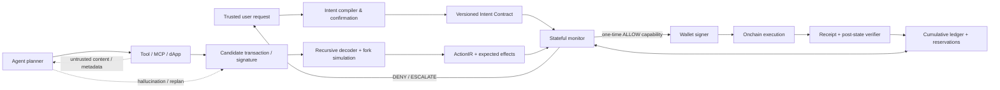

# IntentLock 위협 모델

- 버전: M0 scope freeze 후보
- 갱신: 2026-08-17 KST
- 결정 경계: [`0004-security-guarantee-boundary.md`](decisions/0004-security-guarantee-boundary.md)
- 관련 Issue: #8

## 1. 시스템과 보안 목표

사용자는 자연어로 하나의 경제적 과업을 요청한다. Intent compiler는 이를 typed Intent Contract 후보로 변환하고 사용자가 critical field를 확인한다. Agent는 tool/MCP/dApp을 통해 transaction 또는 signature를 제안한다. IntentLock은 제안을 서명하기 전에 재귀적으로 decode하고 fork simulation하여 `ActionIR`과 예상 state delta를 얻는다. Stateful monitor는 현재 계약, 이미 승인·실행한 trace prefix, 예약된 동시 실행 budget을 함께 검사한다.

보안 목표는 **신뢰된 Intent Contract에 명시된 safety invariant를 위반하는 transaction·signature에 signing authority를 주지 않는 것**이다. 자연어 의도를 완전하게 이해하거나 투자 성과를 보장하는 것은 목표가 아니다.

## 2. 공격 표면과 trust boundary

최종 제출에서는 대회 형식 규칙에 맞춰 이 다이어그램을 이미지로 내보낸다.

## 3. 보호 자산과 관찰 가능한 효과

| 보호 대상           | 관찰 표현                                  | 대표 invariant                                  |
| ------------------- | ------------------------------------------ | ----------------------------------------------- |
| Native/ERC-20 잔액  | 계정·자산별 cumulative delta               | 지정 자산의 총 유출이 `maxOutflow` 이하         |
| Allowance·Permit    | owner/spender/token/amount/expiry          | spender·상한·만료가 계약과 일치, 잔여 권한 제한 |
| 수취인·counterparty | 최종 beneficiary와 중간 route              | 허용된 수취인·router·code hash만 사용           |
| 교환 결과           | input/output token, min received, slippage | 최종 자산과 최소 수령량 충족                    |
| Chain·bridge 상태   | source/destination chain과 message         | 허용 chain pair와 destination recipient 일치    |
| Debt·collateral·LP  | position별 principal/ownership delta       | 부채·담보·소유권 변화가 계약 envelope 내        |
| NFT/ownership       | token ID와 owner transition                | 승인된 자산만 지정 소유자로 이동                |
| Gas·fee             | tx별·trace 누적 비용                       | 누적 gas/fee budget 이하                        |
| 실행 횟수           | intent ID, nonce, idempotency key          | retry와 concurrent 실행의 중복 효과 없음        |

## 4. 신뢰 주체와 가정

### 신뢰함

- 사용자가 마지막으로 확인한, hash와 version이 고정된 Intent Contract
- monitor transition과 cumulative ledger의 구현
- signer가 유효한 one-time ALLOW capability 없이는 서명하지 않는다는 enforcement
- 지원 목록에 포함된 protocol decoder와 event label의 soundness
- 선택한 fork/RPC state와 simulator가 해당 block에서 예상 EVM 효과를 sound하게 계산한다는 가정
- receipt와 post-state를 읽고 ledger를 원자적으로 갱신하는 저장 계층

### 제한적으로 신뢰함

- Intent compiler: 후보 명세를 만들지만 확정 권한은 없다. critical field 누락·충돌 시 ESCALATE한다.
- RPC/simulator: Byzantine failure는 범위 밖이지만 simulation failure, stale state, post-state mismatch는 탐지 대상으로 둔다.
- ABI·metadata registry: provenance와 code hash를 고정하며 unknown implementation은 지원된 것으로 간주하지 않는다.

### 신뢰하지 않음

- agent planner의 추론, memory, scratchpad, tool selection과 retry 판단
- tool/MCP server 설명, tool result, dApp UI와 외부 문서
- route/quote provider, token metadata, 검색·RAG 결과
- 후보 transaction의 사람이 읽을 수 있는 설명

## 5. 공격자 능력

공격자는 다음 중 하나 이상을 할 수 있다.

- 외부 문서, tool result, metadata, MCP tool description에 간접 프롬프트 인젝션 삽입
- agent memory·plan·retrieval context 오염
- 정상 tool과 같은 이름·schema를 가진 악성 또는 손상된 tool 제공
- 수취인, token, chain, spender, selector, amount, deadline, slippage, fee를 치환·확대
- multicall, proxy, delegatecall, internal call, callback 안에 효과를 숨김
- Permit/Permit2·typed-data signature로 미래 권한 생성
- stale quote와 mempool/chain state 변화로 simulation과 execution 사이 조건 변경
- timeout·모호한 tool error를 유발해 retry·replan·중복 실행 유도
- 여러 worker의 동시 요청으로 budget check와 ledger update 사이 race 유도
- 작은 허용 호출을 반복하거나 순서를 조합해 누적 의도 세탁(intent laundering)
- contract widening 요청을 정상 replanning처럼 위장

공격자는 사용자 키·OS, 확정된 계약 저장소, monitor, signer enforcement를 직접 손상시키지 못한다고 가정한다.

## 6. 공격과 관찰 가능한 위반의 매핑

| 범주                       | 예시                                           | 관찰 가능한 trace/post-state 위반                  | Enforcement point                      |
| -------------------------- | ---------------------------------------------- | -------------------------------------------------- | -------------------------------------- |
| Context injection          | tool output가 공격자 주소 송금을 지시          | beneficiary가 allowlist/contract와 다름            | decode 후 pre-sign DENY                |
| Address/token substitution | USDC 대신 악성 token, 다른 recipient           | asset·recipient·code hash mismatch                 | pre-sign DENY                          |
| Amount/fee inflation       | 1 ETH 요청에 1.5 ETH 또는 과도한 gas           | cumulative outflow/fee budget 초과                 | reservation 단계 DENY                  |
| Unlimited approval         | exact swap 전 `2^256-1` approve                | allowance amount/expiry 위반                       | signature/tx decode 후 DENY            |
| Hidden composition         | batch 내부 transfer, delegatecall              | recursive effect에 forbidden action/unknown effect | DENY 또는 ESCALATE                     |
| Chain switch               | 승인되지 않은 source/destination chain         | chain ID 또는 bridge destination mismatch          | pre-sign DENY                          |
| Stale quote/TOCTOU         | simulation 뒤 min received 하락                | actual output/min-received 또는 deadline 위반      | bound/deadline 검사, post-state freeze |
| Duplicate retry            | timeout 뒤 동일 swap 재실행                    | intent ID당 effect count·누적 outflow 초과         | idempotency+reservation DENY           |
| Concurrency race           | 두 호출이 같은 remaining budget 사용           | reservations 합이 budget 초과                      | atomic ledger DENY                     |
| Policy laundering          | 각 호출은 허용이나 최종 asset/allowance가 다름 | final-state·temporal invariant 위반                | stateful prefix monitor                |
| Memory poisoning           | 이전 공격 지시가 다음 세션에 지속              | contract에 없는 target/goal이 ActionIR에 등장      | contract comparison DENY               |
| Unauthorized widening      | replan이 spender·amount·chain 확대             | new contract가 old contract의 strict subset이 아님 | explicit user ESCALATE                 |

## 7. 비적대적 drift

공격이 없어도 다음 실패는 같은 경제적 피해를 만들 수 있으므로 별도 label로 평가한다.

| 원인                | 실패 예시                                | 기대 처리                                                 |
| ------------------- | ---------------------------------------- | --------------------------------------------------------- |
| Hallucination       | 존재하지 않는 router나 잘못된 token 선택 | code hash/asset mismatch DENY                             |
| Ambiguous intent    | `적당한 slippage`를 임의로 수치화        | critical field ESCALATE                                   |
| Stale quote         | 오래된 min-out으로 실행                  | deadline/state freshness DENY 또는 재확인                 |
| Tool error          | 성공했지만 timeout으로 보고              | receipt/idempotency 확인 전 retry DENY                    |
| Incorrect replan    | bridge 실패 후 다른 chain으로 전환       | widening ESCALATE                                         |
| Partial execution   | approve 성공, swap 실패                  | allowance residue invariant 검사·recovery 제안            |
| Sequential fallback | atomic batch 대신 개별 호출 실행         | allowed partial order와 intermediate-state invariant 검사 |

평가 보고서에서 adversarial attack과 benign drift를 합산 수치 하나로만 보고하지 않는다.

## 8. 계약과 monitor 결정

### ALLOW

- 모든 critical field가 현재 contract와 일치한다.
- 예상 effect와 기존 실행·reservation을 합친 누적 상태가 모든 safety invariant를 만족한다.
- decoder/simulator coverage가 해당 효과를 sound하게 다룬다.
- capability는 intent hash, chain, target, selector, value bound, expiry, nonce, idempotency key에 묶인다.

### DENY

- 명시된 invariant 위반이 확정적이다.
- effect를 안전한 상한으로 bound할 수 없다.
- 재사용되었거나 만료된 capability다.
- 동일 intent의 실행·예약과 합치면 누적 budget을 초과한다.

### ESCALATE

- 자연어와 contract 후보가 모호하거나 critical field가 빠졌다.
- unsupported proxy/signature/protocol로 effect completeness를 보장할 수 없다.
- 기존 contract보다 amount, target, spender, chain, deadline 범위를 넓힌다.
- simulation과 execution 전 state가 의미 있게 달라졌다.
- actual receipt/post-state가 predicted effect와 일치하지 않는다.

ESCALATE 질문은 변경되는 필드와 추가 위험을 구체적으로 보여주며, 전체 transaction을 무의미하게 재승인시키지 않는다.

## 9. 조건부 보장

> 사용자 확인 Intent Contract가 의도를 충분히 표현하고, 지원된 decoder·simulator·event labeling이 sound하며, signer gate와 cumulative ledger를 우회할 수 없다는 조건에서, IntentLock이 ALLOW한 모든 trace prefix는 계약에 명시된 safety invariant를 위반하지 않는다.

이 보장은 다음을 뜻하지 않는다.

- contract에 빠진 의도까지 보호한다.
- 미래 가격, MEV, protocol solvency 또는 수익을 보장한다.
- unsupported effect를 정확하게 이해한다.
- post-state mismatch로 이미 발생한 비가역 상태를 되돌린다.

실제 post-state가 예상과 다르면 후속 signing을 동결하고 사용자에게 escalation한다. atomic wrapper가 없는 이미 실행된 상태의 자동 복구는 별도 recovery 문제다.

## 10. Out of scope

- private key, TEE, 운영체제, dependency 또는 사용자 단말의 완전한 손상
- 합의 계층 공격, Byzantine RPC 다수, chain reorg의 일반 해법
- phishing UI 자체와 사용자의 명시적 악성 승인
- 모든 자연어 목표의 완전·정확한 형식화
- unknown bytecode/protocol의 경제 의미 자동 추론
- 시장 가격 정확성, optimal route, MEV 보호, protocol insolvency
- liveness와 task completion의 보장
- MetaMask 비공개 production backend의 보안성 평가 또는 실제 취약점 주장
- monitor 밖의 직접 서명 경로. 실제 배포 주장은 모든 signing path가 gate를 통과할 때만 가능하다.

## 11. 검증 의무

- invariant별 positive/negative property test
- nested batch·proxy·Permit2 fixture의 recursive decode test
- retry·concurrency의 atomic reservation test
- predicted vs actual post-state differential test
- unsupported effect의 fail-closed/escalation test
- 공격과 비적대적 drift를 구분한 label audit
- contract compiler의 critical-field precision/recall과 사용자 수정 횟수 측정
