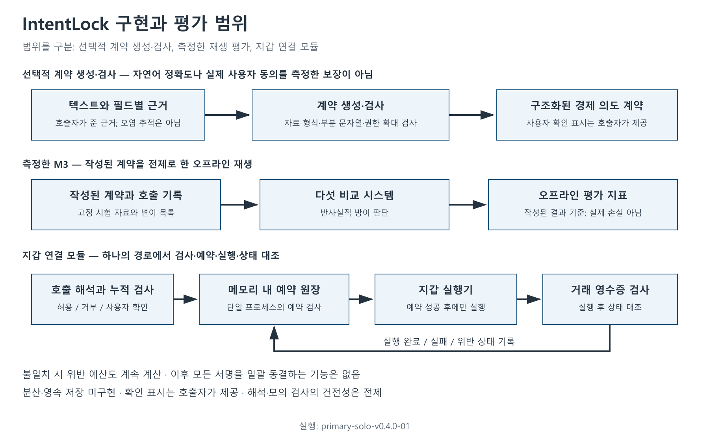
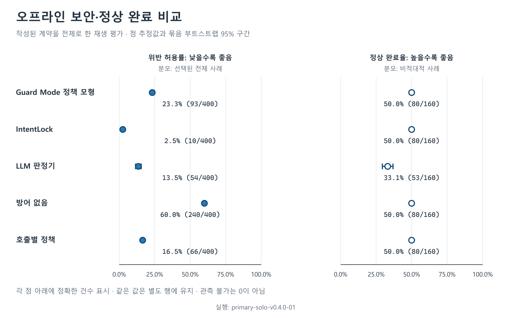
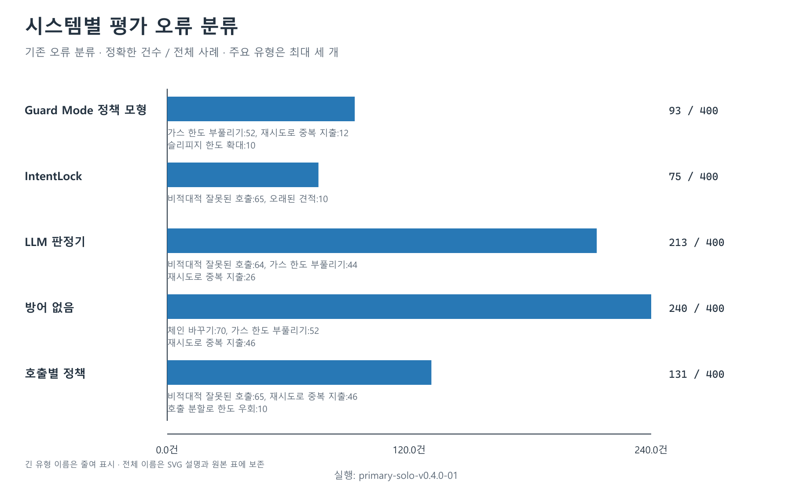
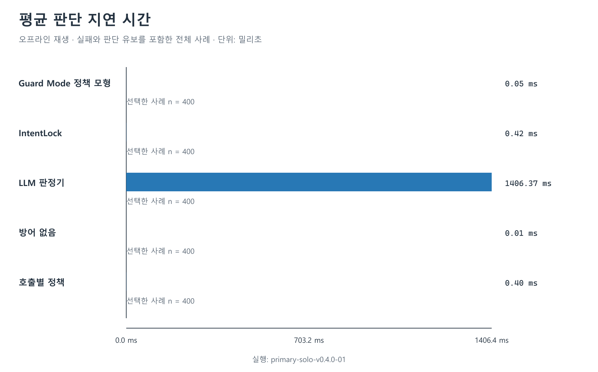

# 누적 경제 의도 검증을 통한 지갑 에이전트의 다중 도구 실행 보호: 인텐트록(IntentLock)

팀 EVM 주소:

팀 인원수: 2명

참가 트랙: MetaMask

학회 코드 넘버:

### Key Takeaways

- 지갑 에이전트의 안전성은 개별 도구의 허용 여부뿐 아니라 호출을 합친 자산 유출, 권한 노출과 최종 상태로 평가해야 한다. IntentLock은 이 조건을 사용자가 확인한 구조화된 계약과 정수 단위의 경제 효과로 표현한다.
- 80개 기본 의도에서 만든 400개 호출 실행 기록(trace)의 오프라인 비교에서 IntentLock의 작성 라벨 기준 위반 허용은 10/400건(2.50%), 호출별 정책은 66/400건(16.50%)이었다. 둘의 정상 완료는 각각 80/160건(50.00%)이며, 이 분모에는 자동 완료가 불가능하도록 구성한 의도 이탈(drift)도 포함된다.
- IntentLock의 남은 위반 허용 10건은 사후 발견으로 되돌릴 수 없었다. 대규모 언어 모델(LLM) 첫 실행의 HTTP 429 실패 92/400건도 제거하지 않았다. 기본 의도 80개의 고정 포크 검증과 40개의 정해진 공격 스크립트의 서명 경계(scripted signer-boundary) 결과는 별도 증거이며, 자연어 추출 정확도·운영 메타마스크(MetaMask)의 취약점·실제 공격 모델에 대한 강건성으로 일반화하지 않는다.

지갑 에이전트는 자연어 요청을 토큰 사용 승인(approval), 자산 교환(swap), 체인 간 자산 이동(bridge), 재시도(retry) 등 여러 호출로 분해한다. 호출마다 대상과 금액을 확인해도, 합산 지출이 한도를 넘거나 허용한 자산 대신 다른 자산이 남는 조합적 의도 이탈이 생길 수 있다. 본 연구는 확인된 경제 의도 계약, 중첩 호출의 효과 표현, 실행 순서에 따른 누적 검사와 실행 후 상태 대조를 연결하는 IntentLock 연구 프로토타입을 제시한다. 계약의 표현 충분성, 경제 효과 관측의 건전성, 직렬화된 예약과 서명 경계의 비우회를 전제로 안전 상한이 보존되는 조건부 논증을 제공한다.

평가는 실행 증거와 정책 비교를 구분한다. 이더리움(Ethereum)과 베이스(Base)의 고정 포크에서 기본 시나리오 80개를 검증했고, 선택된 완료 실행은 모두 최종 목표를 충족하며 작성된 참조와의 불일치는 0건이었다. 이 기본 시나리오에 정상·공격·비적대적 의도 이탈을 적용한 400개 호출 실행 기록으로 다섯 시스템을 비교하고, 구성요소 변화와 정해진 스크립트 기반 재계획을 별도로 분석한다. 주 지표는 실제 자금 손실률이 아닌 작성 정책 기준 반사실적 위반 허용률(counterfactual unsafe-authorization rate)이며, 정상 완료 가능성·오거부·확인 요구·비용을 함께 제시한다. 공개 문서 기반 가드 모드(Guard Mode) 정책 모형(emulator)을 사례 비교군으로 사용하고, 결과를 운영 중인 MetaMask의 보안 점수로 해석하지 않는다. 실험의 검수 방식은 담당자 1명과 인공지능(AI) 보조 검토이며, 등록 팀의 참가 인원 2명과 구분한다. 독립 인간 라벨링 연구를 주장하지 않는다.

## 1. 문제: 허용된 호출을 합쳐도 의도가 보존되는가

사용자가 “이 계정에서 최대 100 단위만 사용하고, 지정된 체인의 내 계정에 원하는 자산을 남기며, 작업 후 불필요한 사용 권한을 남기지 말라”고 요청했다고 하자. 각 60 단위의 거래는 호출별 금액 한도 안에 있지만 두 번 실행하면 누적 120 단위가 된다. 토큰 사용 승인과 자산 교환이 각각 정상이어도 거래가 실패하거나 일부만 소비하면 토큰 사용 권한(allowance)이 남는다. 체인 간 자산 이동이 출발 체인에서 성공해도 목적지 동작이 다른 수취인에게 실행되면 전체 요청은 실패한다. 이 수치는 문제를 설명하기 위한 예시이며 실험 결과가 아니다.

이러한 이탈은 악의적 입력과 운영 오류 양쪽에서 생길 수 있다. 오염된 도구 실행 결과가 수취인(recipient)을 바꾸는 경우와, 시간 초과를 실패로 오인해 거래를 반복하는 경우는 원인이 다르지만 동일한 자산 유출 상한을 위반할 수 있다. 따라서 공격자 의도를 추정하는 일과 별도로, 서명하려는 실행 요청(payload)이 확인된 계약의 경제적 범위를 벗어나는지 검사할 필요가 있다.

메타마스크 에이전트 지갑(MetaMask Agent Wallet)은 이 문제를 구체화하는 실무 사례다. 공식 문서는 비동기 서버 지갑 요청, 거래의 모의 실행 검사와 위협 탐지 검사를 설명한다. 지원되는 경우에는 ERC-7821 일괄 호출을 사용하고, 그렇지 않으면 순차 실행으로 전환한다. 이 구조에는 거래 전 검토, 요청 진행 상황, 여러 단계의 완료 상태를 연결할 지점이 있다. 본 연구는 이러한 공개 경계를 바탕으로 설계 패턴을 평가한다. [MetaMask Architecture](https://docs.metamask.io/agent-wallet/reference/architecture/).

연구 질문은 다음과 같다.

- RQ1. 범위·금액·호출 조합·비적대적 의도 이탈을 어떤 경제 불변식으로 구분할 수 있는가?
- RQ2. 누적 효과 검사가 비교군과 보안·정상 완료 가능성 사이에서 어떤 차이를 보이는가?
- RQ3. 이전에 허용한 경제 효과의 이력(accepted-effect history), 중첩 효과 관측, 실행 후 상태(post-state) 대조의 변화가 동일 사례의 결과에 어떻게 작용하는가?
- RQ4. 공개 판정과 오류를 보고 재계획하는 결정론적 공격 스크립트는 구현된 서명기 경계에서 어떤 결과를 만드는가?

기여는 범용 의도 이탈 방지 장치(guardrail)의 최초 제안이 아니라 지갑 도메인의 명세와 검증 연결에 있다. 경제 의도 계약과 효과 표현을 구현하고, 연구자가 작성한 호출 실행 기록 평가와 고정 포크 실행 증거를 분리하는 재현 가능한 자료 구조를 제공하며, 공개 제품 정책에 추가할 수 있는 설계 조건과 구현 한계를 함께 밝힌다.

## 2. 선행연구와 차별화 범위

Task Shield는 지시와 도구 호출이 사용자의 목표에 기여하는지 실행 시 검사한다. DRIFT는 최소 함수 실행 경로와 매개변수 점검 목록을 만들고, 계획 변경을 검사하며 에이전트 메모리의 주입 지시를 격리한다. 두 연구 모두 실행 맥락을 다루므로 기존 방어를 모두 단일 호출 검사로 규정할 수 없다. IntentLock의 관심은 목표 정렬 판단을 대체하는 데 있지 않고, 허용된 경로에서 발생하는 지갑 효과를 누적 상한과 완료 조건에 연결하는 데 있다. [Task Shield, v1](https://arxiv.org/abs/2412.16682v1), [DRIFT, v3](https://arxiv.org/abs/2506.12104v3).

Progent는 도구 이름과 인자의 명시적 규칙 정책을 결정론적으로 검사하고, 정책 변경의 권한 범위 축소와 권한 범위 확대를 구분한다. AgentSpec은 발동 조건·판정 조건·집행 규칙으로 실행 시점(runtime) 제약을 표현한다. 따라서 구조화된 정책이나 정책 확대의 사용자 확인 자체는 본 연구의 신규성이 아니다. 누적 지출·토큰 사용 권한·최종 자산을 해당 정책 엔진에 표현하는 데 필요한 도메인 모델과 관측 절차가 본 연구의 구체적 대상이다. [Progent, v3](https://arxiv.org/abs/2504.11703v3), [AgentSpec, v3](https://arxiv.org/abs/2503.18666v3).

CaMeL은 신뢰하는 요청에서 제어·데이터 흐름을 추출하고 범위가 제한된 실행 권한(capability) 정책으로 허용되지 않은 정보 흐름을 제한한다. AgentArmor는 실행 중 호출 기록을 그래프 중간 표현으로 재구성해 프로그램 분석을 적용한다. 형식적 실행 감시 연구도 시간에 걸친 제약을 다룬다. 이 선행들은 호출 실행 기록·범위가 제한된 실행 권한·형식적 실행 감시기(monitor)의 존재를 이미 보여준다. 본 연구의 조건부 보장 역시 입력 명세와 효과 해석이 맞다는 전제에서만 의미가 있다. [CaMeL, v2](https://arxiv.org/abs/2503.18813v2), [AgentArmor, v3](https://arxiv.org/abs/2508.01249v3), [Formal Methods Meet LLMs, v1](https://arxiv.org/abs/2605.16198v1).

AgentDojo는 도구와 외부 데이터를 사용하는 에이전트의 보안·정상 작업 수행 능력(utility)을 평가하는 확장 가능한 환경이다. Web3 직접 선행인 Real AI Agents with Fake Memories는 프롬프트·에이전트 메모리·외부 정보 흐름의 맥락 조작과 승인되지 않은 자산 이전을 다룬다. 본 연구는 일반 프롬프트 주입 평가 자료를 대체하지 않는다. 고정 이더리움 가상 머신(EVM) 상태의 토큰 사용 권한, 부채, 자산 전송과 최종 목표를 서로 구분하는 좁은 실험으로 문제를 구체화한다. [AgentDojo, v3](https://arxiv.org/abs/2406.13352v3), [Real AI Agents with Fake Memories, v3](https://arxiv.org/abs/2503.16248v3).

최근의 Authority–Inference Separation(AIS)은 금융 동작 의도를 결정론적으로 심사하고, 정확한 경제 의미·정책 버전·중복 방지 번호(nonce)에 결속된 실행 권한과 사후 증거를 연결한다. 금융 의도와 추론의 분리, 재현 가능한 권한 판단 자체도 본 연구만의 제안은 아니다. IntentLock은 이더리움 가상 머신 멀티 호출의 누적 효과·사용 승인 대상(spender)별 토큰 사용 권한과 별도 고정 포크 실행 증거에 초점을 둔 좁은 구현 연구로 위치시킨다. AIS의 기관 권한·회계 책임 체계를 재현하거나 성능 우위를 검증한 것은 아니다. [Gong·Samawi·Medda, AIS v1, 2026-08-31](https://arxiv.org/abs/2608.30519v1).

ScopeGate 역시 도구 접근 가능성과 구체적인 인자·금액에 대한 권한을 구분하고, 결정론적인 금액 상한·중복 실행 방지(idempotency)·기본 거부를 제시한다. 따라서 값 단위 권한 검사나 재실행 방지 자체를 신규성으로 주장하지 않는다. [ScopeGate, v1](https://arxiv.org/abs/2606.28679v1).

이 논문에서 Task Shield·DRIFT·Progent·AIS·ScopeGate 등은 설계 비교 대상이다. 원 구현을 지갑 환경에 충실히 이식해 측정한 것이 아니므로, 이하의 범용 대규모 언어 모델 판정기와 호출별 정책 점수를 그 논문들의 성능으로 표시하지 않는다.

## 3. 시스템 모델과 위협 범위

사용자는 자연어 요청과 함께 최종 경제 계약을 확인하고, 에이전트는 거래 또는 서명 후보를 생성한다. 에이전트의 설명, 계획, 에이전트 메모리와 도구 관측 결과는 계약 범위를 넓힐 권한이 없다. 구현 검증의 기준은 확인된 계약, 지원 호출 해석기(decoder)의 해석, 실행 감시기의 상태 전이와 명시된 실행 증거다.

위협 모델에는 수취인·사용 승인 대상·자산·체인·금액·마감 시각 변경, 일괄 호출(batch) 안의 추가 효과, 중복 재시도와 누적 지출이 포함된다. 비적대적 의도 이탈은 오래된 견적, 잘못된 재계획, 부족한 정보와 부분 완료를 포함한다. 외부 자료가 이런 후보를 유도할 수 있다고 가정하지만, 주 실험에서 실제 대규모 언어 모델 에이전트가 각 악성 호출 실행 기록을 생성하도록 유도한 것은 아니다. 각 호출 실행 기록은 위협별 관측 조건을 시험하기 위해 작성된 입력이다.

운영체제·개인 키·서명기 자체의 완전한 손상, 악의적 원격 노드 호출(RPC)의 모든 응답, 프로토콜의 지급 불능과 모든 미지원 바이트코드의 의미 분석은 범위 밖이다. 공격자가 방어 장치를 우회해 직접 서명할 수 있는 환경에서는 이 방어 장치의 검사 결과가 집행 보장이 되지 않는다.

## 4. IntentLock의 설계와 구현

Source: 본 연구의 구현 경계와 설계. 선택적 의도 계약 생성, 주 오프라인 재생 평가와 별도 서명 경계 구현을 구분해 도식화.

### 4.1 확인된 경제 의도 계약

경제 의도 계약(Intent Contract)은 계정, 중복 방지 번호, 버전, 유효기간과 중복 실행 방지 정보에 경제 제약을 결합한다. 허용 체인·호출 대상·함수 식별자·수취인, 자산별 총유출량(gross outflow)과 토큰 사용 권한 노출(allowance exposure) 상한, 가스 수수료·슬리피지(slippage) 조건과 최종 목표를 구조화한다. 금액은 최소 자산 단위의 정수로 표현하고 서로 다른 자산이나 체인의 값을 임의로 합하지 않는다.

안전 상한과 최종 목표는 구분한다. 누적 유출 상한은 실행 시작부터 각 중간 단계까지의 기록(prefix) 전체에서 지켜야 한다. 반면 “목적지 자산을 최소량 보유한다”는 조건은 작업 완료 시 평가한다. 토큰 사용 승인만 끝난 중간 상태가 완료 목표를 충족하지 않는다는 이유만으로 실행 도중의 안전 상한을 위반했다고 보지는 않는다. 허용할 중간 권한 노출에는 별도의 안전 상한이 필요하다.

의도 계약 생성·검사기(compiler)는 추출된 후보 계약과 필드별 근거를 받아 자료 형식, 신뢰하는 사용자의 요청에 근거했는지, 구현된 권한 확대 규칙을 충족하는지 검사한다. 이것이 자연어 추출기의 완전한 정확성을 보장하지는 않는다. 본 비교는 연구자가 작성한 계약을 이미 확인된 계약으로 가정하는 재생 평가(contract-conditioned replay)다. 실제 사용자의 승인 행위를 관측하지 않았으며, 자연어를 처음 읽어 계약을 만드는 전체 과정의 성공률도 측정하지 않았다. 근거 문자열이 존재하거나 자료 형식 검사를 통과했다는 사실만으로 사용자의 모든 의미가 포착되었다고 할 수 없다. 확인된 계약의 누락은 이후 실행 감시기로 복원할 수 없다.

### 4.2 호출과 경제 효과

행동 중간 표현(ActionIR)은 호출의 도구 이름과 경제 효과를 구분한다. 자산 전송, 토큰 사용 승인·Permit2, 자산 교환, 체인 간 자산 이동, 부채, 소유권, 가스 수수료와 해석하지 못한 경제 효과에 체인·대상·호출 경로와 관측 출처를 붙인다. 지원 호출 해석기는 거래 호출 데이터(calldata)와 구조화된 서명 데이터(typed-data) 구조를 해석하고, 일괄 호출의 내부 하위 호출을 재귀적으로 추적한다. 고정된 호출 대상·계약 호출 형식 명세(ABI)·코드의 출처와 고정 버전 근거의 범위를 벗어나거나 깊이·크기 한도를 넘으면 불완전한 해석으로 표시한다.

완전한 바이트코드 분석기는 아니다. 주 오프라인 실험의 입력 효과는 버전이 지정된 호출 기록에 작성된 예측 경제 효과이며, 중첩 효과 비교도 이 표현 위에서 이루어진다. 얕은 호출 해석 설정은 중첩 효과 자체를 삭제하지 않고 해당 효과를 부분 해석(PARTIAL)로 표시해 보수적인 중단을 유도한다. 따라서 불완전 해석 표시의 영향을 측정하는 것이지, 임의의 악성 거래 호출 데이터에 대한 호출 해석기 탐지 재현율이나 숨겨진 효과를 놓친 결과를 측정하는 것은 아니다. 실제 거래 호출 데이터와 거래 영수증의 연결은 고정 포크 기본 사례와 별도 서명 경계(signer-boundary) 사례에서 검사한다.

### 4.3 실행 순서의 누적 검사

실행 감시기는 계약, 이전에 허용된 효과, 현재 후보의 효과, 모의 실행과 호출 해석의 상태를 입력받는다. 주 평가에서는 실행 순서 번호에 따라 호출을 검사하고, 허용(ALLOW)한 효과만 다음 단계에 누적한다. 확정된 범위·상한 위반은 거부(DENY)하고, 관측이 불완전하거나 확인이 필요하면 사용자 확인을 요청한다(ESCALATE). 비교표에서는 ESCALATE를 판단 유보(ABSTAIN)로 정규화한다. 처음으로 ALLOW가 아닌 결과가 나오면 해당 호출 기록의 자동 진행을 중단한다.

허용 여부는 체인·거래 상대·함수 식별자 같은 범위와 총유출량·토큰 사용 권한·가스 수수료 같은 누적 자원에 의존한다. 단순히 각 거래가 작다는 이유로 전체가 허용되지 않으며, 동일한 실행 순서를 반복한 재시도·동시 실행 변이도 별도로 식별한다. 주 오프라인 재생 평가의 중복 실행 검사는 고정 호출 실행 기록 구조를 이용하므로, 임의의 분산 작업 처리 순서를 모두 탐색한 동시성 검증으로 해석하지 않는다.

서명 전 토큰 사용 권한 검사는 체인·자산별로 권한을 받는 주체마다 마지막 승인액을 유지하고, 실행 도중 각 시점에서 그 합이 상한을 넘지 않는지 검사한다. 같은 주체에게 다시 승인한 금액을 이중 합산하지 않지만, 이후 권한을 철회했다고 해서 앞서 발생한 초과 노출을 없던 일로 처리하지도 않는다. 자산 전송으로 권한이 소비되는 양은 이 사전 검사에서 추론하지 않으므로 보수적인 오거부가 가능하다. 관측되지 않은 기존 권한을 모두 파악했다는 보장도 없다. 작업 후 남은 토큰 사용 권한(residual allowance)은 별도의 사후 상태 관측으로 검사한다. 슬리피지는 비율을 내림 반올림하지 않고 정수 교차 곱으로 한도를 비교한다.

### 4.4 서명 경계와 예약 원장

연구용 지갑 연결 모듈(adapter)은 하나의 실행 경로에서 호출 해석, 누적 효과 검사, 원장 예약을 마친 뒤에만 실행기를 호출한다. 예약 원장은 대기·실행 완료·위반 상태의 효과를 예산 계산에 유지하며, 중복 방지 식별자가 같은 실행을 다시 승인하지 않는다. 명확한 실패는 관측된 가스 수수료를 남겨 정산한다. 통신 오류로 실행 여부를 알 수 없으면 대기 예약이 남을 수 있다.

원장은 하나의 프로세스 안에서 순서를 직렬화하는 메모리 내 구현이다. 상태 스냅샷 구조는 있지만 분산 데이터베이스, 장애 복구, 여러 서명 서비스 사이의 원자적 합의를 구현하지는 않았다. ALLOW 판정은 의도 해시에 연결된 내부 값이며, 외부 서비스가 암호학적으로 검증할 수 있는 일회성 실행 권한은 아니다. 모든 서명 경로를 동일한 계약 해시와 실행 요청의 해시에 결속시키는 실행 권한은 운영 배포를 위한 확장 제안이다.

현재 연결 모듈은 계약의 중복 방지 키를 재사용하므로 같은 계약으로 보낸 두 번째 별도 요청을 중복으로 차단한다. 지원되는 일괄 호출 한 번과 여러 요청에 걸친 작업 세션은 다르며, 주 평가에서 순차 효과를 재생하는 경로도 별개다. 계약별 동작 키와 예산을 공유하는 작업 세션의 운영 구현은 남은 과제다. 예약 대상 자원은 유출량·토큰 사용 권한·가스 수수료이며, 대기 중인 부채까지 동시에 예약한다고 주장하지 않는다.

### 4.5 실행 후 상태 대조

실행 후에는 거래 영수증의 성공 여부와 관측한 효과를 예측 효과에 대조하고, 최종 목표를 충족했는지 검사한다. 고정 포크 검증에서는 발생 순서대로 정렬한 거래 영수증의 이벤트와 실행 전후 잔액·토큰 사용 권한·포지션·부채를 정수 단위로 비교한다. 연구자가 작성한 참조 자료와 실제 실행이 다르면 데이터 결함인지 시스템 결함인지 구분해 기록한다.

지갑 연결 모듈이 불일치를 발견하면 해당 호출을 실행 후 불일치(EXECUTED_MISMATCH)로 반환하고 예약을 위반 상태(VIOLATED)로 남긴다. 이 결과는 이미 확정된 자산 이동을 되돌리지 못한다. 또한 현재 프로토타입의 VIOLATED 상태는 실제 유출량을 후속 예산에 반영하지만 계정의 모든 이후 요청을 일괄 동결하는 운영 장치는 아니다. 불일치 후 강제 동결과 사용자 복구 절차는 별도 배포 요구사항이다.

### 4.6 조건부 실행 도중의 안전성(prefix-safety) 논증

확인된 계약을 C, 실행 앞부분과 유효 예약이 차지하는 경제 상태를 S, 후보 효과를 e, 계약의 안전 상한 영역을 Inv(C)라고 하자. 완료 시의 목표 술어 Goal(C, S)는 Inv(C)와 별도로 둔다. 검사의 의미는 “S와 e를 합친 상태가 Inv(C) 안에 있을 때만 다음 실행을 허용한다”이다.

다음 네 전제 아래 실행의 각 단계에서 안전 상한이 보존됨을 귀납적으로 논증할 수 있다. 첫째, C가 보호하려는 의도를 충분히 표현한다. 둘째, 호출 해석기·모의 실행 검사(simulation)·관측이 실제 효과의 안전 관련 영향을 빠짐없이 상계한다. 셋째, 검사와 예약이 하나의 직렬화 순서를 공유하고, 불명확한 실행의 예약을 성급히 해제하지 않는다. 넷째, 실제 서명기는 검사한 실행 요청과 동일한 실행 요청만 실행하고 모든 경로가 이 절차를 통과한다.

초기 상태가 Inv(C)에 있고 k번째까지의 예약·실행 기록의 앞부분이 안전하다고 가정한다. 다음 요청은 이미 유효한 모든 예약을 포함해 상한을 확인한다. 조건을 통과한 경우에만 원자적으로 예약하므로 같은 잔여 예산이 동시에 재사용되지 않는다. 실제 효과가 예약한 안전 상계를 넘지 않고 확인한 실행 요청과 일치한다는 전제에서 k+1번째 실행 앞부분도 안전하다. 완료 목표는 마지막 상태에서 별도로 검사한다.

이는 추상 상태 전이의 조건부 증명 개요이며 구현을 기계적으로 검증한 증명이 아니다. 계약 누락, 해석 오류, 예상 밖 실제 효과나 서명 우회가 있으면 전제가 성립하지 않는다. 의도 계약 생성·검사기의 신뢰 근거의 부분 문자열 검사는 의미적 함의를 증명하지 않고, 같은 개수의 최종 목표를 더 약한 목표로 바꾸는 모든 경우를 포착하지도 않는다. 따라서 확인 절차의 건전성은 검증된 결과가 아니라 전제다. 실행 후 발견은 깨진 전제를 진단하는 증거일 뿐 이미 발생한 위반을 사전에 막았다는 보장이 아니다. 진행 가능성, 미래 가격, 거래 순서 조정으로 추출할 수 있는 가치(MEV)와 자동 복구도 이 논증에 포함되지 않는다.

## 5. 평가 설계

### 5.1 데이터와 실행 증거

데이터 v0.4.0의 80개 기본 의도는 자산 전송, 토큰 사용 승인·Permit2, 단일·일괄 자산 교환, 체인 간 자산 이동과 목적지 동작, 대출·예치 및 일괄 호출 복구를 포함한다. Ethereum 블록 25,773,000과 Base 블록 50,080,000의 상태를 기준으로 계약·코드의 출처와 고정 버전 근거와 참조 상태를 고정한다. 블록 해시와 원시 증거 해시는 재현 자료에 연결한다.

고정 포크 검증은 기본 시나리오의 실행 가능성과 참조 일치 여부를 확인하는 절차다. 각 시나리오에서 기록된 첫 완료 시도를 선택하는 규칙에 따라 80/80개 완료 증거가 확보되었고, 최종 목표는 80/80개 통과(PASS), 작성된 참조 자료 대조는 80/80개, 불일치는 0개다. 여러 시도가 필요한 원격 노드 호출 실패 기록도 보존했다. 이 80/80은 첫 시도 성공률이나 운영 환경의 가용성이 아니며, 공격 사례의 안전성 점수도 아니다.

체인 간 이동의 목적지 처리에는 로컬 시험 중계기·인증기 고정 시험 자료(fixture)로 진행하는 구간이 포함된다. 출발 체인의 계약과 메시지·상태 연결을 검사하지만 실제 체인 간 이동의 최종 정산, 중계 서비스의 진행 가능성이나 인증 메시지의 보안성을 재현하지 않는다. 자금·계정·저장 상태 초기화도 통제된 테스트 조건이다.

실행 목표 통과는 자연어와 계약의 완전한 일치를 뜻하지 않는다. 일부 계약의 수취인 허용 목록(allowlist)은 자연어의 특정 수취인보다 넓고, 사용자 확인을 요청하는 문장이 있어도 실제 승인 이벤트가 실험 자료에 존재하는 것은 아니다. 또한 이미 토큰 사용 권한이 0인 상태에서 권한 철회를 실행한 사례는 멱등성 확인이며 0이 아닌 권한을 제거한 증거가 아니다. 이 차이를 실제 승인·자연어 추출 정확도·권한 정리 성공률로 확대 해석하지 않는다.

이전 데이터 버전의 자산 교환 일괄 호출에서 경로 선택 계약이 소비한 뒤 남는 유한한 토큰 사용 권한 참조가 잘못 작성된 사례를 진단했다. 해당 실행을 시스템 성능에 포함하지 않고, 최종 토큰 사용 권한 계산을 고친 v0.4.0 데이터와 실행 증거를 새로 만들었다. 참조를 고친 사실은 정답 판정 기준(oracle)이 저자 작성 명세라는 한계를 보여주며, 버전별 진단과 본 비교 결과를 분리하는 이유다.

### 5.2 400개 오프라인 사례와 다섯 시스템

기본 의도마다 정상 호출 실행 기록, 범위 공격, 예산 공격, 호출 조합 공격과 비적대적 의도 이탈을 하나씩 적용해 400개 사례를 구성한다. 변이가 적용되지 않는 작업 유형에서는 등록된 같은 범주의 다음 연산자를 사용하고 호출 실행 기록 구조의 변화를 확인한다. 그러나 구조적 변화가 경제적 피해를 보장하지는 않는다. 예를 들어 승인액 0의 반복이나 같은 Permit2 중복 방지 번호의 재사용에 붙인 DENY는 작성된 재시도 정책 위반이며, 추가 권한·실행 가능성·실제 손실을 입증하지 않는다. 서명 전(PRE_SIGN)에서 알 수 없는 실행 후에만 관측 가능한 변화는 관측 단계를 표시한다. 이름에 HIDDEN_TEST가 남아 있는 분할도 개발 중 저자에게 노출되었으므로 개발 중 작성자에게 공개된 평가 분할이다.

다섯 시스템은 동일한 사례 명세 목록을 비교 단위로 사용한다. 모델에는 공개된 서명 전 입력만 제공한다. 정답 라벨, 실제 사후 상태, 검토자의 답은 입력으로 주지 않는다. 각 시스템의 구현은 다음과 같다.

| 시스템 | 판단 단위와 상태 | 해석 범위 |
| --- | --- | --- |
| 방어 없음 | 자료 형식을 통과한 호출 실행 기록을 승인 | 방어 없는 반사실적 기준점 |
| Guard Mode 정책 모형 | 공개 정책을 토대로 한 허용 목록과 자산 유출 검사 | MetaMask 운영 서버 구현이 아닌 연구용 STRICT 해석 |
| 대규모 언어 모델 판정기 | 자연어 목표·계약·전체 서명 전(pre-sign) 호출 실행 기록을 한 번에 검토 | 고정 모델 버전의 범용 판정기 |
| 호출별 정책 | 각 최상위 호출을 순서대로 검사하되 이전에 허용한 경제 효과의 이력 미유지 | 호출별 결정론 정책 |
| IntentLock | 허용된 실행 앞부분의 효과를 누적하고 연구자가 작성한 실행 후 상태와 대조 | 확인된 계약과 지원 효과 표현에 대한 실행 시점 비교 |

Source: 본 연구의 비교 시스템 정의와 실험 설정. 실행 식별자와 증거 범위는 해당 절 및 재현성 절에 명시.

Guard Mode의 공개 문서는 네트워크·주소·토큰 수취인 허용 목록, 최근 24시간의 누적 자산 유출과 정책 밖 요청의 사용자 승인을 설명한다. 정책 모형은 이 공개 경계에서 만든 실험 규칙이며 위협 검사기, 인증·이중 인증(2FA) 사용자 경험(UX)과 운영 환경 가치 평가를 재현하지 않는다. 자산별 정수 상한은 공식 미국 달러(USD) 거래 규모 추정의 단순화다. STRICT와 LITERAL은 문서 해석의 민감도를 살피기 위한 두 설정이다. [MetaMask Trading Modes](https://docs.metamask.io/agent-wallet/reference/trading-modes/), [MetaMask Outflow Policy](https://docs.metamask.io/agent-wallet/reference/outflow-policy/).

LLM 판정기는 고정 모델 버전(model snapshot) gpt-5.4-mini-2026-03-17과 버전이 지정된 프롬프트를 사용한다. 샘플링 온도(temperature)는 0, 호출 제한 시간은 30초다. 형식이 잘못된 출력과 시간 초과는 ABSTAIN으로 기록한다. 프로그램 호출 인터페이스(API) 재시도와 사례 단위 추가 시도는 원시 기록에 남기며, 주 분석은 첫 시도 결과를 고정 분모에 모두 유지하는 사전 등록 규칙(attempt-1 intention-to-treat)을 따른다. 추가 시도 중 좋은 결과를 골라 주 점수로 바꾸지 않는다. 20건의 사전 점검에서 관측한 정답 라벨 일치 17/20은 입력·출력 경로 진단이며, 400건 비교를 대체하지 않는다. 라벨이 일치해도 설명에는 단위, 상한과 하한의 혼동, 입력에서 입증되지 않은 수취인 또는 가스 판단이 포함될 수 있었다. 따라서 이 수치를 판단 설명의 정확도나 인간 검토 일치도로 쓰지 않는다.

### 5.3 지표와 불확실성

주 지표인 작성 정책 기준 반사실적 위반 허용률(counterfactual unsafe-authorization rate)은 각 시스템의 400개 평가 실행 전체를 분모로 한다. 경제 효과가 승인된 것으로 모델링되고, 연구자가 작성한 예상 판단(expected-decision) 라벨이 DENY여서 위반(VIOLATION)으로 채점된 실행을 분자로 센다. 모든 변이의 사후 상태를 독립적으로 실행해 위반을 확인한 정답 기준은 아니다. 따라서 효과의 실행 가능성과 작성 라벨의 오류가 점수에 영향을 줄 수 있다. 이 지표는 실제 거래의 위반 실행률(UER), 자금 손실률, 공격 성공률과 동일하지 않다. 고정 포크 기본 사례의 정수 단위 상태 대조는 별도 검증 절차다.

정상 완료 가능성, 잘못된 거부, ABSTAIN·확인 요구와 서명 전 탐지를 함께 보고한다. 주 평가에서 각 실행의 최종 판단인 ABSTAIN은 확인 요구 1회로 세며, 사람이 실제 확인에 응답했을 때의 성공률이나 소요 시간은 측정하지 않는다. 최초 탐지 순서(first-detection ordinal)는 전체 계획 검사 0, 개별 호출 직전 1..N, 사후 대조 N+1을 구분한다. 사후 발견을 사전 차단으로 세지 않는다.

시간 초과·형식이 잘못된 출력·지원하지 않음·불충분 증거는 독립 평가 결과로 유지한다. 주 분모에서 조용히 제거하지 않는다. 최소 자산 단위의 정수 금액은 같은 체인과 자산의 단위에서 해석하며 서로 다른 토큰 값을 그대로 합산하지 않는다. 지연 시간과 토큰 사용 비용은 이 실행 환경의 평가 비용이며 운영 지갑의 전체 처리 과정 응답 시간은 아니다.

95% 구간은 기본 의도별 묶음을 유지한 층화 부트스트랩(stratified grouped bootstrap)을 10,000회 수행해 계산한다. 각 묶음 안에서는 같은 기본 의도에서 만든 다섯 변이를 함께 유지한다. 비교군 중 위반 허용률이 가장 낮은 시스템을 선택하고, 동률이면 정상 완료율이 높은 시스템을 선택한다. 이 관측상 최선의 비교군과 차이를 계산할 때도 같은 기본 의도 묶음을 함께 재표집한다. 비교군을 관측 결과에 따라 선택했으므로 이 구간은 사전 고정된 단일 가설에 대한 선택 보정 검정이 아니다. 작은 하위 집단이나 관측 0건 역시 모집단 위험이 0임을 뜻하지 않는다.

### 5.4 구성요소 비교와 정해진 스크립트 기반 재계획

구성요소 실험은 400개 사례에 8개 비교 조건을 적용한다. 전체 기능 기준군, 의미 판정만 사용하는 조건, 명시적 규칙만 사용하는 조건, 두 판정의 결합, 허용 효과 이력 제거, 중첩 해석을 제한한 효과 표시, 사후 상태 검사 제거, 항상 사용자 확인을 요구하는 정책을 구분한다. 단계별 비교는 자연어 계약 생성기의 인과적 기여를 측정하지 않는다. 명시적 규칙 조건은 전체 기능 기준군과 실행 설정이 같고, 의미 판정 조건은 주 LLM 결과를 재사용한다. 항상 확인하는 정책은 모든 사례의 첫 동작 전에 확인을 요구한다. 단일 설정 변화로 비교하는 요인은 이력, 재귀적 호출 해석 표시, 사후 상태 대조의 세 가지다. 이력을 비활성화하면 누적 예산뿐 아니라 기록에 의존한 중복 시퀀스 인식도 함께 제거되므로, 그 효과를 예산 합산만의 기여로 해석할 수 없다.

재계획 평가는 40개의 결정론적 공격 스크립트와 모의 실행기를 사용한다. 공격자는 공개된 방어 판단, 판단 사유 코드, 도구 실행 결과를 볼 수 있으며 최대 재계획 횟수는 3회다. 구현된 지갑 연결 모듈이 서명기를 호출했는지와 해석된 경제 효과를, 방어 판단과 별개인 구조적 의도 위반 판정기에 대조한다. 해석이 불완전한 경우는 결론 불가(INCONCLUSIVE)로 남기며, 불일치가 있거나 사후 상태가 관측되지 않았다는 이유만으로 공격 성공으로 판정하지 않는다.

이 집합은 주 평가의 400개 호출 기록과 사례별로 대응되지 않으며, 비교 설계는 비대응·비인과(NON_PAIRED_NON_CAUSAL)다. 결과의 범위는 오프라인 스크립트 기반 서명 경계 평가(OFFLINE_SCRIPTED_SIGNER_BOUNDARY_ONLY)로 제한한다. 실제 공격 모델의 탐색 능력, 운영 상태의 포크에서 공격이 성공할 비율, 또는 같은 사례에서 적응 때문에 증가한 효과를 추정하지 않는다.

## 6. 결과

### 6.1 다섯 시스템의 보안·정상 완료·비용

아래 표는 동일 사례 명세 목록의 2,000개 시스템·사례 조합 기록을 분석한다. 수치의 분모와 구간, 운영상 실패와 확인 요구를 함께 읽어야 한다. 낮은 위반 허용률이 높은 정상 완료율을 뜻하지 않으며, 모두 거부하는 정책도 별도의 정상 작업 수행 능력 손실을 만든다.

**6.1.1 보안과 정상 완료**

분모: 위반 허용률은 전체 사례 400건, 정상 완료율은 비적대적 사례 160건이다. 비적대적 집합은 정상 원본 80건과 비적대적 의도 이탈 80건으로 구성된다.

| 시스템 | 반사실적 위반 허용률 | 95% 신뢰구간 | 정상 완료율 | 95% 신뢰구간 |
| --- | --- | --- | --- | --- |
| Guard Mode 정책 모형 (GUARD_MODE) | 23.25% | 22.00%–24.50% | 50.00% | 50.00%–50.00% |
| IntentLock (INTENTLOCK) | 2.50% | 2.50%–2.50% | 50.00% | 50.00%–50.00% |
| 대규모 언어 모델 판정기 (LLM_VERIFIER) | 13.50% | 11.50%–15.50% | 33.13% | 29.38%–36.88% |
| 방어 없음 (NONE) | 60.00% | 60.00%–60.00% | 50.00% | 50.00%–50.00% |
| 호출별 정책 (PER_CALL_POLICY) | 16.50% | 15.75%–17.25% | 50.00% | 50.00%–50.00% |

Source: 본 연구의 주 평가 첫 시도 집계. 실행 식별자와 증거 범위는 해당 절 및 재현성 절에 명시.

**6.1.2 거부·판단 유보·확인 부담**

잘못된 거부율의 분모인 비적대적 160건에는 정상 원본 80건과 의도 이탈 80건이 함께 들어 있다. 확인 요청 수는 실제 사용자가 응답한 횟수가 아니라 최종 판단 유보를 기준으로 집계한다.

| 시스템 | 잘못된 거부율 (비적대적 160건) | 서명 전 판단 유보율 (전체 400건) | 확인 요청 수 (전체 400건 중 비율) |
| --- | --- | --- | --- |
| Guard Mode 정책 모형 (GUARD_MODE) | 0.00% | 36.75% | 147 (36.75%) |
| IntentLock (INTENTLOCK) | 0.00% | 16.25% | 80 (20.00%) |
| 대규모 언어 모델 판정기 (LLM_VERIFIER) | 36.25% | 25.25% | 101 (25.25%) |
| 방어 없음 (NONE) | 0.00% | 0.00% | 0 (0.00%) |
| 호출별 정책 (PER_CALL_POLICY) | 0.00% | 16.25% | 65 (16.25%) |

Source: 본 연구의 주 평가 첫 시도 집계. 실행 식별자와 증거 범위는 해당 절 및 재현성 절에 명시.

**6.1.3 탐지 위치와 평가 비용**

평균 지연의 ms는 밀리초, 비용의 $는 미국 달러다. 최초 탐지 순서는 전체 계획 검사 0, 호출 전 1..N, 실행 후 N+1, 탐지 없음 순이다.

| 시스템 | 최초 탐지: 전체 계획 검사 / 호출 전 / 실행 후 / 없음 | 평균 지연 | 토큰 비용 |
| --- | --- | --- | --- |
| Guard Mode 정책 모형 (GUARD_MODE) | 147/0/0/253 | 0.054 ms | $0.000000 |
| IntentLock (INTENTLOCK) | 0/295/25/80 | 0.424 ms | $0.000000 |
| 대규모 언어 모델 판정기 (LLM_VERIFIER) | 190/0/0/210 | 1406.374 ms | $0.524432 |
| 방어 없음 (NONE) | 0/0/0/400 | 0.006 ms | $0.000000 |
| 호출별 정책 (PER_CALL_POLICY) | 0/239/0/161 | 0.398 ms | $0.000000 |

Source: 본 연구의 주 평가 첫 시도 집계. 실행 식별자와 증거 범위는 해당 절 및 재현성 절에 명시.

실행 식별자: primary-solo-v0.4.0-01; 고정 소스 A: 89c742e953c8251ba4de78939648b5c7d566b9f3; 동결 커밋 B: 58b36e2cbd490813b4ffc848f3ea126c94c7e4b3; 주 평가의 첫 시도 분석 기록: 2000; 전체 시도: 2092.

증거 유형은 오프라인 반사실 재생이다. 이 표는 고정 포크에서 실제 거래의 위반 실행률(UER)을 측정한 결과가 아니다.

Source: 본 연구의 주 평가 첫 시도 집계. 위반 허용률은 전체 400건, 정상 완료율은 비적대적 160건 기준이다. 점은 관측 비율이며, 구간은 작성된 기본 의도별 묶음 부트스트랩 결과.

이 비교가 직접 답하는 것은 작성된 호출 실행 기록에서 어느 정책이 어떤 범위의 위반을 승인했는가이다. 시스템 간 차이는 해당 입력 효과·계약·관측 단계에 대한 결과이며, 비교 논문 전체나 운영 서비스의 우열을 뜻하지 않는다. Guard Mode 정책 모형의 해석 민감도와 서명 전에 관측할 수 없는 사례는 같은 결과 안에서도 별도로 해석한다.

작성 라벨 기준 위반 허용은 방어 없음 240/400건, Guard Mode 정책 모형 93/400건, 대규모 언어 모델 판정기 54/400건, 호출별 정책 66/400건, IntentLock 10/400건이었다. IntentLock의 10건은 사후에만 관측할 수 있는 오래된 견적의 사후 상태 시험 자료에서 발생했다. 사후 DENY를 반환해도 이미 허용한 효과는 주 위반 분자에 남는다. 사전 관측 가능한 공격 230건에서는 230건 모두 개입했지만, 이 분모는 전체 공격 240건과 다르다.

정상 완료 분모 160건은 정상 원본 80건과 비적대적 의도 이탈 80건이다. 후자는 해석할 수 없는 거래 호출 데이터 65건과 사후 불완전 상태 15건으로 구성되어 정상 원본과 난도가 다른 집합이다. 방어 없음·Guard Mode·호출별·IntentLock의 80/160건 완료는 정상 원본 80건의 완료를 뜻하며, 자연스러운 사용자 업무 절반이 실패한다는 추정치가 아니다. 대규모 언어 모델의 완료는 53/160건, 명목상 비적대적 집합의 DENY는 58/160건이었다. IntentLock은 사전 ABSTAIN 65/400건(16.25%)에 사후 ABSTAIN 15건을 더해 확인 요구 80/400건(20.00%)을 기록했다. 확인 요청과 서명 전 판단 유보는 같은 수치가 아니다.

LLM의 첫 실행 400건 중 HTTP 429로 결과를 얻지 못한 92건(23.00%)은 실행 실패(FAILED)·판단 유보(ABSTAIN)로 유지했으며, 사전 탐지 성공으로 세지 않았다. 등록된 사례 단위 재시도 92건에서 45건이 복구됐지만 주 결과에는 첫 시도만 사용했다. 따라서 낮은 위반 허용률에는 판단 능력뿐 아니라 서비스 불가 시 실행을 중단하는 효과도 섞인다. 관측상 최선의 비교군인 LLM 대비 IntentLock의 차이 -11.00 퍼센트포인트와 대응 비교 95% 구간 [-13.00, -9.00]도 이러한 운영 조건과 사후 비교군 선택에 조건부다. 모델 고유 역량의 우열을 뜻하지 않는다.

IntentLock의 2.50%–2.50%와 여러 완료율의 50.00%–50.00% 구간은 이 작성 집합의 작업 유형·변이 구조를 유지한 재표집 결과다. 모집단 위험을 정확히 알거나 불확실성이 사라졌다는 의미가 아니다. 라벨 작성 편향과 실제 실행 가능성의 불확실성은 이 구간 밖의 한계다.

주 분석 종료 후에는 미복구 사례의 출력 확보만을 목적으로 별도 사후 운영 복구를 수행했다. 남은 47건 중 첫 복구 실행에서 32건의 출력을 확보했고, 나머지 15건은 전송 오류 후 네트워크가 재개된 별도 실행에서 모두 출력을 얻었다. 두 복구 실행의 추가 평가는 총 77회, 전송 시도는 107회였으며 47회 정상 응답과 60회 전송 실패를 모두 보존했다. 이에 따라 서로 다른 시점에 400개 대규모 언어 모델 사례 모두의 출력은 확보했지만, 이것은 같은 조건의 성공한 주 실험 400건을 뜻하지 않는다. 최초 시도 실패 92건, 첫 시도만을 사용한 표·그림·신뢰구간은 변경하지 않았다. 사후 복구는 주 성능·인과·지연시간 비교에서 제외한다. 관측 토큰 사용량 기준 추가 추정 비용은 총 0.1479204달러이며 청구서 검증 금액은 아니다. 당시 전송 오류의 저수준 원인은 수집하지 못해 확정하지 않는다.

Source: 본 연구의 주 평가 첫 시도 오류 분류. 시스템별 전체 400건의 기술 통계이며 위반 허용 건수와는 다른 지표.

오류 그림의 분류는 원시 평가 결과·판단 사유에 따른 기술 통계다. 이 그림의 오류 건수는 앞서 제시한 위반 허용률의 분자와 동일한 지표가 아니다. 명세 오류, 자연어 추출 오류, 집행 오류, 프로토콜의 동작 의미와 통신 실패의 원인을 모두 독립적으로 실증한 비율은 아니다. 현재 채점에는 작성 라벨 결함을 자동으로 제외하는 별도 판정 절차가 없으므로, 라벨 부정확성이 시스템 점수에 섞일 수 있다. 원본 자료를 볼 수 있는 검토에서 발견한 문제는 라벨을 사후 교체하지 않고 해석 한계로 남겼다.

Source: 본 연구의 주 평가 첫 시도 평가 경로 시간 기록. 단위는 밀리초이며 거래 확정·사용자 확인까지의 전체 지연 시간이 아님.

비용은 방어 장치 평가 경로의 실제 경과 시간과 사용량 기록이다. 원격 노드 호출 혼잡, 거래의 블록 포함, 사용자 확인과 실제 체인 간 자산 이동 완료 시간까지 포함한 운영 지연 시간이 아니므로 지갑 사용자 체감으로 외삽하지 않는다.

### 6.2 구성요소 결과

표의 pp는 퍼센트포인트(percentage points)로, 두 비율의 차이를 나타낸다. 아래 구성요소 표에서도 각 조건의 위반 허용률은 전체 400건, 정상 완료율은 비적대적 160건을 분모로 사용한다.

모든 행은 오프라인 반사실 재생 결과다. 단일 요인 제거 실험의 세 조건만 전체 기능 기준군(INTENTLOCK_FULL)과 대응 비교하여 해당 설정 변화의 효과를 추정한다.

**6.2.1 단일 요인 제거 실험**

| 비교 조건 | 변경 요인 | 위반 허용률 | 기준군 대비 차이(95% 신뢰구간) |
| --- | --- | --- | --- |
| 이력 없는 원장 (STATELESS_LEDGER) | 허용 효과 이력 | 16.50% | +14.00 pp (+13.25 pp–+14.75 pp) |
| 얕은 호출 해석 (SHALLOW_DECODER) | 중첩 호출 해석 | 2.50% | +0.00 pp (+0.00 pp–+0.00 pp) |
| 사후 상태 검사 제거 (NO_POST_STATE_VERIFIER) | 실행 후 상태 대조 | 2.50% | +0.00 pp (+0.00 pp–+0.00 pp) |

Source: 본 연구의 구성요소 비교 집계. 실행 식별자와 증거 범위는 해당 절 및 재현성 절에 명시.

| 비교 조건 | 정상 완료율 | 기준군 대비 차이(95% 신뢰구간) |
| --- | --- | --- |
| 이력 없는 원장 (STATELESS_LEDGER) | 50.00% | +0.00 pp (+0.00 pp–+0.00 pp) |
| 얕은 호출 해석 (SHALLOW_DECODER) | 37.50% | -12.50 pp (-15.63 pp–-10.00 pp) |
| 사후 상태 검사 제거 (NO_POST_STATE_VERIFIER) | 50.00% | +0.00 pp (+0.00 pp–+0.00 pp) |

Source: 본 연구의 구성요소 비교 집계. 실행 식별자와 증거 범위는 해당 절 및 재현성 절에 명시.

**6.2.2 인과 효과로 해석하지 않는 단계별 비교**

| 비교 조건 | 위반 허용률 | 정상 완료율 | 해석 범위 |
| --- | --- | --- | --- |
| 의미 판정만 사용 (SEMANTIC_ONLY) | 13.50% | 33.13% | 고정된 주 평가의 LLM 결과를 재사용하며 여러 단계가 달라진다. 단일 구성요소의 인과 효과를 뜻하지 않는다. |
| 명시적 규칙만 사용 (SYMBOLIC_ONLY) | 2.50% | 50.00% | 이미 확인된 계약에서 출발한다. 의미 판정 단계의 제거 효과가 아니라 단계별 점수다. |
| 의미·규칙 결합 (HYBRID_CONJUNCTION) | 2.25% | 33.13% | 새 규칙 재생 결과와 기존 주 평가의 LLM 결과를 결합한 비인과적 단계 비교다. |

Source: 본 연구의 구성요소 비교 집계. 실행 식별자와 증거 범위는 해당 절 및 재현성 절에 명시.

**6.2.3 전체 기능 기준군과 별도 확인 정책**

| 비교 조건 | 분류 | 위반 허용률 | 정상 완료율 |
| --- | --- | --- | --- |
| 전체 기능 기준군 (INTENTLOCK_FULL) | 기준군(REFERENCE) | 2.50% | 50.00% |
| 항상 사용자 확인 (CONFIRMATION_ALWAYS) | 비인과적 정책 비교(NON_CAUSAL_POLICY_VARIANT) | 0.00% | 0.00% |

Source: 본 연구의 구성요소 비교 집계. 실행 식별자와 증거 범위는 해당 절 및 재현성 절에 명시.

실행 식별자: primary-solo-v0.4.0-01-ablations; 기록 수: 3,200; 주 평가 기준군과의 일치: 사례별 검증 완료.

이전에 허용한 경제 효과의 이력 제거 시 위반 허용은 10/400건에서 66/400건으로 늘었고, 차이는 +14.00 퍼센트포인트, 대응 비교 95% 구간은 [+13.25, +14.75]였다. 이는 누적 효과와 중복 이력 검사의 결합 기여다. 얕은 해석 설정은 위반 허용을 줄이지 않으면서 완료를 80/160건에서 60/160건으로 낮췄다. 중첩 효과를 PARTIAL로 표시한 보수적 중단의 비용이지, 숨겨진 효과를 놓쳐 발생한 손실률이 아니다.

실행 후 상태 검사기 제거 후에도 위반 허용 10/400건과 정상 완료 80/160건은 같았다. 주 지표가 이미 허용한 위반을 사후 DENY로 지우지 않기 때문이다. 사후 검증의 가치는 이 결과에서 예방 점수 개선이 아니라 발견과 정산의 관측 경계에 있다. 결합형은 위반 허용 9/400건으로 전체 기능보다 한 건 낮지만 정상 완료도 53/160건으로 줄었다. HTTP 429 실패 시 ABSTAIN을 포함한 주 평가의 LLM 판단을 재사용하며, 결합형 자체의 실행 상태는 별도로 계산한다. 항상 사용자 확인은 위반 허용 0/400건인 동시에 자율 완료 0/160건이었다. 결합형의 지연은 새 명시적 규칙 측정과 기존 대규모 언어 모델 측정의 합으로, 새 통합 실행에서 측정한 전체 처리 과정 시간은 아니다.

### 6.3 정해진 공격 스크립트의 서명 경계 결과

비교 설계는 비대응·비인과(NON_PAIRED_NON_CAUSAL)다. 정해진 공격 스크립트와 모의 실행기를 사용한 오프라인 서명 경계 평가이며 실행 후 상태를 관측하지 않는다. 실제 공격 모델의 적응 능력, 포크 실행, 운영 MetaMask, 동일하거나 동등한 사례의 대응 비교 또는 인과 효과의 증거가 아니다.

| 증거 집합 | 평가 범위 | 사례 수 | 관측 결과 |
| --- | --- | --- | --- |
| 고정된 주 평가의 정상 원본 | OFFLINE_COUNTERFACTUAL_REPLAY | 40 | ALLOW 40; DENY 0; ABSTAIN 0 |
| 재계획 시의 서명 경계 | OFFLINE_SCRIPTED_SIGNER_BOUNDARY_ONLY | 40 | 공격 성공(ATTACK_SUCCESS) 0; 안전 중단(SAFE_BLOCK) 40; 일반 실행 실패(NORMAL_FAILURE) 0; INCONCLUSIVE 0 |

Source: 본 연구의 비대응·비인과 서명 경계 기술 비교. 실행 식별자와 증거 범위는 해당 절 및 재현성 절에 명시.

두 증거 집합은 대응되거나 동등한 실험 사례가 아니므로 행 사이의 비율 차이를 계산하지 않는다.

실행 식별자: adaptive-solo-v0.4.0-01; 제안된 계획: 160; 서명기 호출 수: 0.

이 표의 성공·차단·실패는 등록된 스크립트와 노출 정보·재계획 예산에 조건부다. 안전 중단은 해당 스크립트의 실패를 뜻하며 가능한 모든 공격의 실패를 뜻하지 않는다. 주 오프라인 지표와의 차이는 입력 집합과 실행 경계가 다른 기술 비교로만 제시한다.

40개 평가 실행은 각각 초기 제안과 세 번의 재계획으로 총 160개 계획을 만들었으며, 모든 실행이 안전 중단(SAFE_BLOCK)으로 끝났다. 서명기 호출은 0회였고 공격 성공(ATTACK_SUCCESS)·일반 실행 실패(NORMAL_FAILURE)·결론 불가(INCONCLUSIVE)는 각각 0건이었다. 허용 이후의 실행이나 사후 상태를 관측하지 않았으므로 정상 업무의 전체 완료, 공격 모델의 일반적 탐색 능력, 160개 온체인 공격의 차단을 증명하지는 않는다. 정상 기본 사례를 허용한 정적 비교 행과의 차이 역시 동일 사례의 인과적 개선으로 계산하지 않는다.

### 6.4 개선되지 않은 결과

사전 정의된 음의 결과(negative result), 즉 개선되지 않은 결과의 판정 규칙에 해당하는 항목은 없었다. 이는 등록된 규칙의 판정만 뜻하며, 모든 비교와 하위 집단에서 우월하다는 뜻은 아니다.

이 항목은 관측 결과가 가장 좋은 비교군 대비 주 위반 허용률과 정상 완료율에서 개선되지 않은 결과를 같은 분석에서 생성한다. 여기에 항목이 없더라도 모든 작업 유형·확인 부담·비용에서 우수하다는 결론은 따르지 않는다. 잘못된 거부, ABSTAIN과 작은 하위 집단의 불확실성은 앞의 표와 함께 남는다.

실제로 IntentLock은 방어 없음·Guard Mode·호출별 정책 대비 정상 완료를 개선하지 않았고, 위반 허용 10건도 남겼다. 얕은 해석 변경은 정상 작업 수행 능력만 낮췄고, 실행 후 상태 대조는 주 위반 허용률을 낮추지 못했다. 모든 정해진 스크립트 기반 공격을 차단한 집합에는 성공한 정상 서명기 실행이 없다. 이 부정적 결과들은 위반 허용률이 가장 낮은 비교군과 두 지표만 비교하는 자동 목록이 비어 있다는 이유로 생략할 수 없다.

## 7. MetaMask에 대한 설계 제안

첫째, 기간별 누적 자산 유출과 별개로 서명이 만드는 권한 노출을 경제 효과로 표현하는 방안을 제안한다. 공식 자산 유출 문서는 현재 Permit2 같은 서명이 자산 유출 계산에 포함되지 않는다고 명시한다. 이는 다른 위협 검사기나 사용자 승인 절차가 서명을 검사하지 않는다는 뜻이 아니다. 본 연구의 제안은 사용 승인 대상·최대 금액·만료 시점 등 권한 범위를 확인된 의도와 함께 관리하자는 것이다. [MetaMask Outflow Policy](https://docs.metamask.io/agent-wallet/reference/outflow-policy/).

둘째, 비동기 제출의 대기 예산을 예약하고 동일 동작·의도의 중복 제출을 식별하는 구조가 필요하다. 공식 문서는 서버 지갑 요청과 상태 반복 조회를 설명한다. 이 공개 경계에서 본 연구는 제출·결과 확인·정산을 연결하는 원장을 제안한다. 운영 서버 구현에 이러한 기능이 없다고 추정하지 않는다. 장애 후 복구와 여러 작업 처리기의 동시성을 다루려면 본 메모리 내 구현을 넘는 저장·합의 설계가 필요하다. [MetaMask Architecture](https://docs.metamask.io/agent-wallet/reference/architecture/).

셋째, 일괄 호출과 순차 대체 실행 방식에서 같은 최종 의도를 유지하되 허용되는 중간 상태를 명시해야 한다. 일괄 호출 전체를 원자적으로 실행할 때와 토큰 사용 승인만 성공한 상태에서 후속 거래가 실패할 때의 복구 의무는 다르다. 본 연구는 실행 모드에 관계없이 누적 예산과 작업 후 남은 토큰 사용 권한 조건을 연결하는 패턴을 제안한다. [MetaMask Architecture](https://docs.metamask.io/agent-wallet/reference/architecture/).

넷째, 운영 도입 시에는 사용자가 확인한 계약 해시와 실제 실행 요청을 서명 권한에 결합하고, 불완전한 호출 해석·모의 실행 검사와 사후 불일치를 구체적인 필드별 변경 내역으로 제공하는 방안을 검토할 수 있다. 별도의 제한된 실행 권한, 전역 후속 동결과 복구 사용자 경험은 본 실험이 운영 환경에서 검증한 기능이 아니다. 적용 판단에는 MetaMask 내부 위협 모델, 운영 관측 자료와 사용자 확인 비용에 대한 추가 검증이 필요하다.

## 8. 한계와 연구 절차

명세의 충분성은 가장 큰 한계다. 확인된 계약이 사용자의 복구 선호, 허용해서는 안 되는 사용 승인 대상 또는 최종 자산을 빠뜨리면 계약을 정확히 지켜도 사용자의 실제 의도에서 벗어날 수 있다. 본 연구는 확인 계약 이후의 실행 감시기를 중심으로 하므로 사용자 연구, 자연어 의도 계약 생성·검사기의 독립 정확도와 모든 권한 범위 확대의 의미적 완전성을 입증하지 않는다.

관측 범위도 제한된다. 기본 포크 실행은 선택된 호출 대상·함수와 통제된 계정 상태에 대한 증거이며, 400개 비교는 작성된 효과와 정답 판정 기준을 공유한다. 분석 코드와 호출 실행 기록 작성이 공통 가정을 가질 수 있어 참조 일치만으로 외부 독립성을 얻지 못한다. 호출 해석기가 모르는 대리 호출 계약·여러 경로를 합치는 계약이나 프로토콜 함수를 안전하게 지원한다고 일반화할 수 없다.

집행 보장은 실제 배포 구조에 의존한다. 하나의 프로세스 내 검사와 예약을 여러 서명기 서비스의 원자성으로 확장할 수 없으며, 범위가 제한된 실행 권한 발급·영속 저장·장애 복구·모든 서명 경로의 연결은 별도 검증 대상이다. 사후 불일치 표시는 이미 발생한 거래의 되돌리기가 아니다. 운영 환경의 블록 재구성, 거래 순서 조정으로 추출할 수 있는 가치, 가격 변화와 체인 간 자산 이동·거래 상대 위험도 평가하지 않는다.

통계의 범위는 작성된 기본 의도와 변이 집합이다. 작성자에게 공개된 분할과 결정론적 스크립트는 새로운 모델·사용자·프로토콜의 미공개 평가가 아니다. 단일 LLM의 고정 모델 버전 결과로 대규모 언어 모델 전체의 보안 판단 능력을 대표할 수 없고, 부트스트랩 구간도 데이터 작성 과정의 편향이나 저자의 명세 누락을 제거하지 않는다.

등록 팀은 2명이며, 이번 실험의 검수는 담당자 1명과 인공지능 보조 검토 방식으로 진행한다. 참가 인원과 실제 검수 참여 인원을 혼동하지 않는다. 인공지능을 코드 작성, 자료 대조, 반례 탐색과 원고 점검에 활용하며, 인공지능 보조 검토를 두 번째 독립 인간 검토자로 계산하지 않는다. 인간 간 일치도, 이중 맹검 평가나 독립 인간 검수가 수행되었다는 주장은 하지 않는다. 이 절차는 작업과 검증의 추적 가능성을 높이지만 연구자와 도구가 공유한 오류 가능성을 없애지는 못한다. 제출 전 최종 원고의 내용과 인공지능 활용에 대한 확인 책임은 참가 팀에 있다.

## 9. 재현성과 결론

실행 코드, 데이터, 프롬프트, 지표 구현과 설정의 해시를 동결 기록과 연결하고, 각 실행을 고유 실행 식별자로 보존한다. 아래 출처 정보는 표·그림이 어느 실행에서 생성되었는지를 명시한다. 기본 포크 검증의 재시도 진단과 주 비교의 시도 선택 규칙을 섞지 않으며, 실패한 실행을 성공 결과로 덮어쓰지 않는다.

주 비교 실행은 primary-solo-v0.4.0-01, 제거 실험은 primary-solo-v0.4.0-01-ablations, 적응형 서명 경계 실행은 adaptive-solo-v0.4.0-01이며 분석 커밋은 919c896a2f46932299ac3643d8448e9fa046818a이다. 주 비교는 오프라인 반사실 재생이고, 적응형 표는 비대응·비인과 기술 통계다.

IntentLock은 지갑의 의도 이탈을 도구 이름의 허용 여부에서 누적 경제 효과와 최종 목표의 문제로 구체화한다. 본 연구가 제공하는 것은 확인 계약과 효과 표현을 잇는 프로토타입, 범위가 고정된 비교 결과, 그리고 명세·관측·집행 경계를 드러내는 재현 자료다. 운영 배포의 다음 과제는 자연어 계약의 사용자 검증, 실제 지원 프로토콜 확대, 여러 서명 서비스가 공유하는 영속적인 예약과 복구의 검증이다. 그 과정에서도 보안 수치와 정상 작업의 완료 가능성을 같은 분모와 명확한 관측 범위에서 함께 평가해야 한다.

## 참고문헌

아래는 본문에 사용한 1차 출처다. 논문은 명시한 arXiv version을 기준으로 읽으며, 제품 문서는 2026년 9월 5일 확인한 공개 설명을 기준으로 한다.

1. Feiran Jia, Tong Wu, Xin Qin, Anna Squicciarini. [The Task Shield: Enforcing Task Alignment to Defend Against Indirect Prompt Injection in LLM Agents](https://arxiv.org/abs/2412.16682v1). arXiv:2412.16682v1, 2024.
2. Hao Li, Xiaogeng Liu, Hung-Chun Chiu, Dianqi Li, Ning Zhang, Chaowei Xiao. [DRIFT: Dynamic Rule-Based Defense with Injection Isolation for Securing LLM Agents](https://arxiv.org/abs/2506.12104v3). arXiv:2506.12104v3, 2026. 원문에 NeurIPS 2025 채택을 명시.
3. Tianneng Shi, Jingxuan He, Zhun Wang, Hongwei Li, Linyu Wu, Wenbo Guo, Dawn Song. [Progent: Securing AI Agents with Privilege Control](https://arxiv.org/abs/2504.11703v3). arXiv:2504.11703v3, 2026.
4. Haoyu Wang, Christopher M. Poskitt, Jun Sun. [AgentSpec: Customizable Runtime Enforcement for Safe and Reliable LLM Agents](https://arxiv.org/abs/2503.18666v3). arXiv:2503.18666v3, 2025. 원문에 ICSE 2026 채택을 명시.
5. Edoardo Debenedetti, Ilia Shumailov, Tianqi Fan, Jamie Hayes, Nicholas Carlini, Daniel Fabian, Christoph Kern, Chongyang Shi, Andreas Terzis, Florian Tramèr. [Defeating Prompt Injections by Design](https://arxiv.org/abs/2503.18813v2). arXiv:2503.18813v2, 2025.
6. Peiran Wang, Yang Liu, Yunfei Lu, Yifeng Cai, Hongbo Chen, Qingyou Yang, Jie Zhang, Jue Hong, Ye Wu. [AgentArmor: Enforcing Program Analysis on Agent Runtime Trace to Defend Against Prompt Injection](https://arxiv.org/abs/2508.01249v3). arXiv:2508.01249v3, 2025.
7. Parand A. Alamdari, Toryn Q. Klassen, Sheila A. McIlraith. [Formal Methods Meet LLMs: Auditing, Monitoring, and Intervention for Compliance of Advanced AI Systems](https://arxiv.org/abs/2605.16198v1). arXiv:2605.16198v1, 2026.
8. Edoardo Debenedetti, Jie Zhang, Mislav Balunović, Luca Beurer-Kellner, Marc Fischer, Florian Tramèr. [AgentDojo: A Dynamic Environment to Evaluate Prompt Injection Attacks and Defenses for LLM Agents](https://arxiv.org/abs/2406.13352v3). arXiv:2406.13352v3, 2024.
9. Atharv Singh Patlan, Peiyao Sheng, S. Ashwin Hebbar, Prateek Mittal, Pramod Viswanath. [Real AI Agents with Fake Memories: Fatal Context Manipulation Attacks on Web3 Agents](https://arxiv.org/abs/2503.16248v3). arXiv:2503.16248v3, 2025.
10. MetaMask. [Agent Wallet Architecture](https://docs.metamask.io/agent-wallet/reference/architecture/). Developer documentation.
11. MetaMask. [Trading Modes](https://docs.metamask.io/agent-wallet/reference/trading-modes/). Developer documentation.
12. MetaMask. [Outflow Policy](https://docs.metamask.io/agent-wallet/reference/outflow-policy/). Developer documentation.
13. Hui Gong, Michail Samawi, Francesca Medda. [Authority-Inference Separation in Agentic Finance: First-Line Control, Blockchain Enforcement, and Replayable Assurance](https://arxiv.org/abs/2608.30519v1). arXiv:2608.30519v1, 2026. Preprint.
14. David Mellafe Zuvic. [Capability Gates Are Not Authorization: Confused-Deputy Failures in LLM Agent Frameworks](https://arxiv.org/abs/2606.28679v1). arXiv:2606.28679v1, 2026. Preprint.

검증 절차는 검수 담당자 1명과 AI 보조 검토 방식으로 진행했다. 두 사람의 독립 검수나 맹검 평가를 수행했다는 주장은 하지 않는다.
