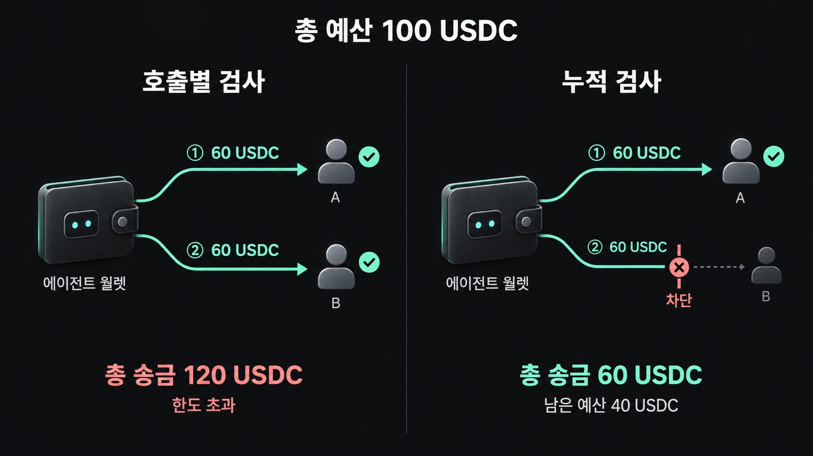
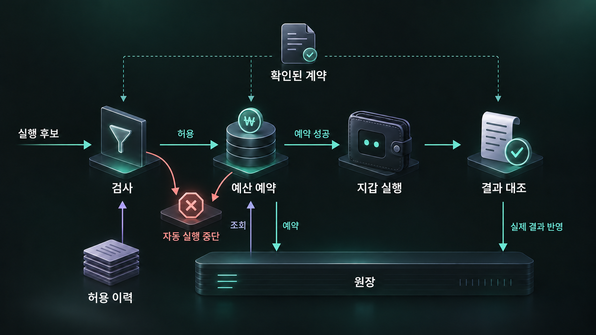
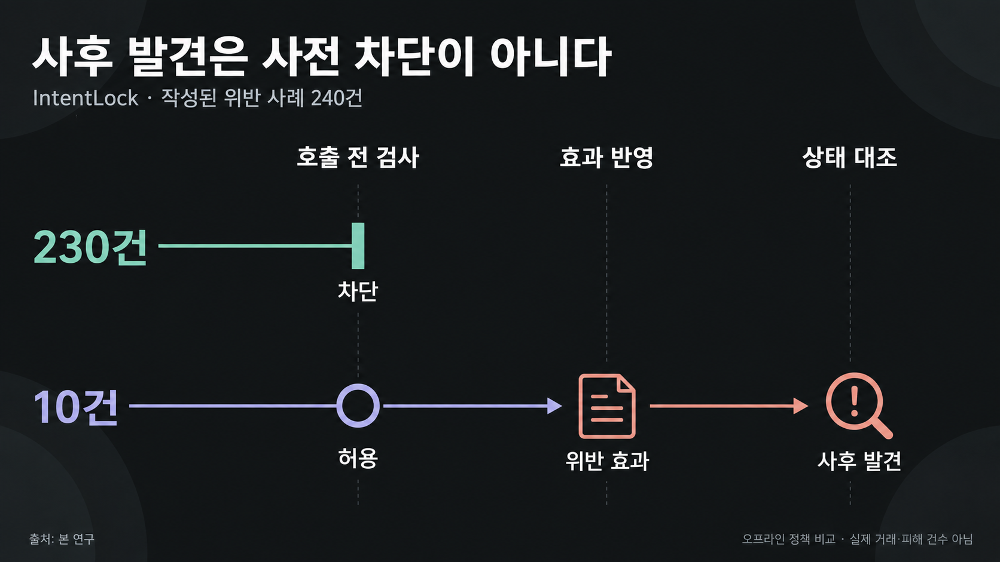

# 안전한 호출은 안전한 실행을 보장하지 않는다: 인텐트록(IntentLock)

팀 EVM 주소:

팀 인원수: 2명

참가 트랙: MetaMask

학회 코드 넘버:

IntentLock 연구 표지

### Key Takeaways

- 지갑의 하루 유출 한도를 지켰다고 사용자의 요청까지 이행한 것은 아니다. [IntentLock](https://github.com/raymond1203/intentlock-agent-wallet)은 한 작업에서 허용한 지출과 토큰 사용 권한을 기록하고, 작업이 끝난 뒤 자산 상태가 확인된 조건에 맞는지 대조하는 연구 프로토타입이다.
- 연구자가 작성한 400개 호출 기록을 오프라인으로 비교했다. 호출마다 따로 검사한 정책은 규칙 위반 기록 66개를 허용했고, 앞선 호출의 효과를 함께 본 [IntentLock](https://github.com/raymond1203/intentlock-agent-wallet)은 10개를 허용했다. 차이가 난 56개는 반복 호출 기록 41개와 누적 유출 초과 15개였다. 실제 거래를 실행해 손실 방지 건수를 측정한 결과는 아니다.
- 두 정책 모두 정상 원본 80개를 전부 완료했다. 완료율 50%(80/160)는 해석 불가·불완전 상태의 비적대적 이탈 80개까지 분모에 포함한 값이다. IntentLock이 허용한 위반 10개는 사후 상태에서만 목표 이탈이 드러나도록 만든 사례로, 나중에 발견했더라도 예방한 것으로 세지 않았다.

지갑 에이전트는 한 요청을 여러 거래로 나누어 실행한다. 거래마다 대상과 금액을 확인하더라도 합산 지출이나 마지막에 남는 자산까지 관리하려면 앞선 실행의 기록이 필요하다. [IntentLock](https://github.com/raymond1203/intentlock-agent-wallet)은 사용자가 확인한 경제 조건에 이 기록을 대조하는 연구 프로토타입이다. 메타마스크 에이전트 지갑의 공개 문서를 실무 사례로 사용했으며, 비교에 쓰인 가드 모드(Guard Mode)는 운영 제품을 재현한 것이 아닌 정책 모형이다.

기본 작업의 실행 여부는 이더리움(Ethereum)과 베이스(Base)의 고정 포크 80개 사례로 확인했다. 정책별 판단은 연구자가 작성한 별도의 호출 기록 400개에 다섯 정책을 적용해 비교했다. 두 평가는 각각 실행 가능성과 정책 판단을 살피며, 하나의 공격 차단율로 합치지 않는다.

## 1. 거래는 성공해도 요청은 어길 수 있다

사용자가 에이전트에게 “지정한 두 주소로 USDC를 나눠 보내되, 총액은 100 USDC를 넘기지 마”라고 요청했다고 하자. 첫 번째 주소에 60 USDC를 보낸 뒤, 두 번째 주소에도 60 USDC를 보내려는 상황이다. 각 송금액을 처음 정한 한도인 100 USDC와 비교하는 검사라면 두 거래를 모두 허용한다. 하지만 첫 송금 후 남은 예산은 40 USDC다. 두 번째 송금을 중단해야 사용자가 정한 총액을 지킬 수 있다.

호출별 검사와 누적 검사의 차이(가상 송금 예시).

지출액만 맞는다고 요청이 이행되는 것도 아니다. 사용자가 토큰 교환에 필요한 권한만 허용하고 작업 후에는 회수해 달라고 요청할 수 있다. 승인과 교환이 별도 거래로 실행된다면, 승인만 성공하고 교환은 실패해 권한만 남을 수 있다. 브리지를 통한 자산 이동도 사용자가 지정한 체인과 계정에 자산이 도착해야 완료된 것으로 볼 수 있다. 거래의 성공 여부와 별개로, 작업이 끝난 뒤 무엇이 남았는지를 확인해야 하는 이유다.

이런 문제는 공격 없이도 생길 수 있다. 응답이 늦었다는 이유로 이미 처리된 송금을 새 거래로 다시 제출하면 지출이 중복될 수 있다. 공격자가 도구 응답을 오염시켜 에이전트가 수취인을 바꾸도록 유도할 수도 있다. 실행 전 검사는 에이전트의 설명에만 의존하지 않고, 실제 거래가 사용자가 정한 수취인·금액·권한 범위에 맞는지 확인해야 한다.

이 연구는 [메타마스크 에이전트 지갑(MetaMask Agent Wallet)](https://docs.metamask.io/agent-wallet/reference/architecture/)을 이러한 작업을 수행하는 지갑의 사례로 삼는다. 가드 모드(Guard Mode)는 이미 [최근 24시간의 누적 자산 유출을 검사](https://docs.metamask.io/agent-wallet/reference/outflow-policy/)한다. 앞의 예시는 이 기능이 없거나 작동하지 않는다는 뜻이 아니다. 여기서 구분하려는 것은 지갑 전체의 일정 기간 유출 한도와 사용자가 특정 작업에 부여한 조건이다. 누적 송금액이 한도 이내인지와 별개로, 그 작업의 수취인과 권한 범위가 지켜졌는지, 마지막에 원하는 자산 상태가 만들어졌는지를 함께 확인해야 한다.

이를 검증하기 위해 네 가지 연구 질문을 설정했다.

- RQ1. 여러 도구 호출이 이어져도 지켜야 할 자산 유출 한도, 수취인, 권한, 완료 조건을 어떻게 검사 규칙으로 표현할 수 있는가?
- RQ2. 앞선 호출의 효과까지 반영하면 정책 위반을 허용하는 사례는 얼마나 줄고, 정상 작업의 완료율은 어떻게 달라지는가?
- RQ3. 이미 허용한 실행 효과를 기억하는 것, 중첩된 호출의 효과를 읽는 것, 실행 후 상태를 확인하는 것은 각각 결과에 어떤 차이를 만드는가?
- RQ4. 정해진 규칙에 따라 검사 결과와 오류를 보고 다음 시도를 바꾸는 공격 스크립트가 서명 직전의 검사를 우회할 수 있는가?

이 질문에 답하기 위해 [IntentLock](https://github.com/raymond1203/intentlock-agent-wallet)에서는 검사 규칙을 추가한 효과와 앞선 호출의 이력을 유지한 효과를 구분한다. 지출 한도뿐 아니라 남은 토큰 사용 권한과 최종 자산 상태까지 함께 다루되, 각각이 어느 시점에 확인되는지 나눠 살펴본다.

## 2. 선행연구: 목표 정렬과 실행 권한

에이전트 보안에서는 행동이 사용자 목표에 맞는지와, 그 행동을 실제로 실행해도 되는지를 함께 살펴야 한다. [Task Shield](https://arxiv.org/abs/2412.16682v1)는 각 지시와 도구 호출이 사용자 목표에 기여하는지 검사한다. [DRIFT](https://arxiv.org/abs/2506.12104v3)는 요청에 필요한 실행 경로와 인자 조건을 정하고, 계획이 바뀔 때 사용자 의도와 권한 제약에 맞는지 확인하며 메모리 속 주입 지시를 격리한다. 두 연구는 에이전트가 외부 정보를 접한 뒤에도 사용자가 맡긴 작업에서 벗어나지 않도록 하는 접근이다.

실행을 허용하는 조건을 명시적 규칙으로 다루는 연구로는 [Progent](https://arxiv.org/abs/2504.11703v3)와 [AgentSpec](https://arxiv.org/abs/2503.18666v3)이 있다. Progent는 도구 이름과 인자를 결정론적으로 검사하고, 권한을 좁히는 정책 변경은 자동으로 반영하되 넓히는 변경에는 명시적 승인을 요구한다. AgentSpec은 어떤 상황에서 어떤 조건을 검사하고, 위반 시 어떻게 개입할지를 규칙으로 표현한다.

실행 과정의 정보 흐름과 시간에 걸친 제약도 다뤄져 왔다. [CaMeL](https://arxiv.org/abs/2503.18813v2)은 신뢰하는 사용자 요청에서 실행 흐름을 정해 비신뢰 데이터가 이를 바꾸지 못하도록 하고, 권한 정책으로 정보 유출 경로를 제한한다. [AgentArmor](https://arxiv.org/abs/2508.01249v3)는 실행 기록을 제어·데이터 흐름 그래프로 바꾸고 프로그램 분석을 적용한다. [Formal Methods Meet LLMs](https://arxiv.org/abs/2605.16198v1)는 시간에 걸친 행동 제약을 논리식으로 표현해 실행 중 위반을 감시하고 개입한다.

금융 거래에서는 도구를 사용할 수 있다는 것과 특정 상대에게 특정 금액을 보낼 권한이 있다는 것의 차이가 더 구체적으로 드러난다. [ScopeGate](https://arxiv.org/abs/2606.28679v1)는 호출 범위와 구체적인 인자, 금액 상한, 중복 실행 여부를 검사하고 허용 조건을 충족하지 못하면 거부한다. [Authority–Inference Separation(AIS)](https://arxiv.org/abs/2608.30519v1)은 에이전트가 제안한 금융 행위가 독립적인 결정론적 검사를 통과해야 실행 권한을 얻도록 하고, 부여한 권한을 사후 결제 증거와 연결한다. 기관의 책임 주체와 위임 범위도 통제 대상에 포함한다. 두 연구는 금융 행위의 권한을 모델의 추론과 분리한다는 점에서 이 연구와 가깝다.

평가에서는 공격을 막았는지와 정상 작업을 수행했는지를 함께 봐야 한다. [AgentDojo](https://arxiv.org/abs/2406.13352v3)는 비신뢰 데이터를 읽고 도구를 실행하는 에이전트를 대상으로 공격과 방어, 정상 작업 수행을 평가하는 확장 가능한 환경이다. 웹3 환경을 다룬 [Real AI Agents with Fake Memories](https://arxiv.org/abs/2503.16248v3)는 프롬프트뿐 아니라 메모리와 외부 데이터의 조작이 승인되지 않은 자산 이전으로 이어질 수 있음을 보이고, 이를 평가하기 위한 [CrAIBench](https://arxiv.org/abs/2503.16248v3)를 제시한다.

[IntentLock](https://github.com/raymond1203/intentlock-agent-wallet)은 이러한 권한 분리와 실행 감시 원칙을 지갑의 작업 단위에 적용한다. 하나의 작업에서 이미 허용한 자산 유출과 권한을 부여받은 주체별 토큰 사용 권한을 추적하고, 작업 종료 시 자산 상태를 사용자가 확인한 조건과 대조한다. 이 글의 초점은 새로운 권한 통제 원리 자체보다, 이 조건들을 여러 거래에 걸쳐 검사할 때 무엇을 기록하고 관측해야 하는지에 있다. 평가에서도 검사 규칙을 추가한 효과와 이전 실행의 이력을 유지한 효과를 구분한다.

이 선행연구들은 설계 원칙을 비교하기 위해 인용했다. 원 구현을 지갑 환경에 이식해 성능을 측정한 것은 아니다. 이후 제시하는 범용 대규모 언어 모델(LLM) 판정기와 호출별 정책의 결과도 해당 논문들의 성능을 뜻하지 않는다.

## 3. 권한 경계와 위협 모델

설계상 사용자는 수취인·자산·지출 한도·완료 조건을 정리한 의도 계약을 확인하고, 에이전트는 거래나 서명 후보를 제안한다. 실행 감시기는 그 후보가 확인된 조건과 이전 허용 이력에 맞는지 검사한다. 에이전트의 설명, 도구 응답, 외부 문서는 참고 자료일 뿐 권한을 확대하는 근거로 신뢰하지 않는다. 주 비교 실험은 연구자가 작성한 계약을 이미 확인된 것으로 가정하며, 실제 사용자 승인이나 자연어 의도의 완전한 추출을 검증한 것은 아니다.

공격자는 도구 결과나 외부 문서, 에이전트의 메모리를 오염시켜 계약을 벗어난 실행 후보를 유도할 수 있다고 가정한다. 수취인, 토큰 사용 권한을 받는 주체, 자산·체인·금액·만료 시각을 바꾸거나, 일괄 호출 안에 추가 동작을 넣고 재시도로 지출을 반복하는 경우를 다룬다. 오래된 견적, 잘못된 재계획, 부족한 정보, 일부 단계만 완료된 상태처럼 공격 없이 생기는 이탈도 포함한다. 다만 주 실험의 악성 호출 기록은 연구자가 작성한 입력이다. 따라서 측정 대상은 주어진 후보에 대한 정책 판단이지, 실제 공격자가 에이전트를 속이는 데 성공할 확률은 아니다.

방어가 유효하려면 확인된 계약과 실행 감시기의 누적 기록을 공격자가 임의로 바꾸지 못하고, 검사한 요청이 그대로 서명기로 전달돼야 한다. 서명기가 이 검사를 거치지 않는 요청도 받아들인다면 방어를 우회할 수 있다. 구현은 호출 해석이 불완전하거나 모의 실행의 성공을 확인하지 못하면 자동 진행을 멈추지만, 모든 스마트 계약의 효과를 알아내는 것은 아니다. 운영체제·개인 키·서명기 자체의 침해, 악의적인 원격 프로시저 호출(RPC) 서비스에 대한 완전한 방어, 프로토콜의 지급 불능은 이 연구의 범위 밖이다.

## 4. 누적 효과를 검사하는 구조

IntentLock 검증 구조

### 4.1 의도 계약: 실행 중 한도와 완료 조건

[IntentLock](https://github.com/raymond1203/intentlock-agent-wallet)의 경제 의도 계약(Intent Contract)은 사용자가 맡긴 작업의 조건을 정리한 명세다. 여기서 계약은 체인에 배포하는 스마트 계약이 아니라, 실행 감시기가 읽는 구조화된 데이터다. 어느 계정의 작업인지, 어디까지 실행해도 되는지, 무엇을 확인해야 완료로 볼지를 담는다.

실행 범위에는 체인, 호출할 계약과 함수, 자산을 받을 주소를 지정한다. 예산에는 자산별 총유출량과 토큰 사용 권한의 상한을 두고, 수수료·슬리피지·유효기간도 제한한다. 금액은 자산의 최소 단위 정수로 기록하며, 체인이나 자산이 다르면 별도로 계산한다. 계정과 계약을 식별하는 정보, 중복 실행 방지 키도 함께 보관한다.

실행 중 지킬 한도와 완료 시 충족할 목표는 구분한다. 예를 들어 토큰 교환을 위해 먼저 사용 권한을 승인하는 단계에서는, 교환할 자산이 아직 들어오지 않았다고 실패로 볼 수 없다. 대신 승인액이 허용 범위 안인지 검사한다. 교환과 권한 정리를 마친 뒤에는 원하는 자산을 충분히 받았는지, 불필요한 사용 권한이 남지 않았는지를 확인한다. 마지막 목표가 달성됐더라도 중간에 한도를 넘긴 사실까지 없어지는 것은 아니다.

명세가 사용자 요청을 제대로 담았는지는 별도의 문제다. 계약 검사기는 형식, 사용자 요청에 포함된 근거 문자열, 구현된 권한 확대 규칙을 확인한다. 그러나 요청의 의미가 빠짐없이 반영됐는지까지 보장하지는 않는다.

### 4.2 도구 이름 대신 자산과 권한의 변화를 읽는다

에이전트가 ‘토큰 교환’이라고 부른 작업에도 사용 권한 승인과 토큰 이동이 함께 포함될 수 있다. 행동 중간 표현(ActionIR)은 이런 호출을 자산과 권한의 변화로 풀어 쓴다. 어떤 체인의 자산이 누구에게 얼마나 이동하는지, 누구에게 사용 권한을 주는지와 함께, 그 근거가 호출 데이터인지 모의 실행인지도 기록한다. 호출 해석기는 지원 대상으로 등록된 거래 호출 데이터(calldata)와 Permit2 서명 데이터를 읽고, 지원하는 일괄 호출 안에서는 하위 호출도 따라간다. 모르는 대상·함수나 해석 한도를 벗어난 부분은 불완전한 해석으로 남긴다.

400개 기록의 주 비교에는 연구자가 작성한 예측 효과를 사용했다. ‘얕은 해석’ 조건도 숨은 효과를 실제로 찾아내는 시험이 아니라, 중첩 효과가 있는 기록을 부분 해석(PARTIAL)으로 표시하는 비교다. 정보가 불완전할 때 정상 작업이 얼마나 더 중단되는지를 살핀 것이며, 임의의 악성 계약에서 숨은 효과를 찾아내는 정확도는 측정하지 않았다. 실제 호출 데이터와 거래 영수증·사후 상태의 연결은 별도의 고정 포크 기본 사례에서 확인했다.

### 4.3 허용한 효과를 다음 검사에 반영한다

실행 감시기는 새 호출만 따로 보지 않고, 앞서 허용한 효과까지 반영해 계약의 범위와 한도를 검사한다. 400개 기록의 주 비교에서는 호출을 순서대로 평가하고, 허용(ALLOW)한 효과만 다음 판단에 넘겼다. 한도나 범위를 명확히 벗어나면 거부(DENY)하고, 해석이나 관측이 불완전하면 추가 확인이 필요한 상태(ESCALATE)로 남긴다. 비교표에서는 이를 판단 유보(ABSTAIN)로 표시한다. 거부하거나 판단을 유보한 시점에서 자동 진행은 멈추며, 이후 사람이 확인해 작업을 재개하는 과정은 이 비교에 포함하지 않았다.

누적한다고 해서 모든 금액을 더하는 것은 아니다. 자산 유출은 합산하지만, 토큰 사용 권한은 체인·자산별로 권한을 받은 주체마다 마지막 승인액을 유지한다. 같은 주체에게 2 USDC의 사용 권한을 두 번 설정했다고 4 USDC로 세지 않는다는 뜻이다. 여러 주체에게 준 권한은 합산하고, 실행 도중 그 합이 한도를 넘은 적이 있는지 검사한다. 나중에 권한을 회수해도 앞선 초과를 없던 일로 처리하지는 않는다. 다만 토큰을 사용하면서 줄어드는 승인액은 사전 검사에서 추론하지 않으므로 정상 요청을 보수적으로 거부할 수 있다. 입력에 없는 기존 권한까지 파악하는 것은 아니며, 작업 후 남은 권한은 별도의 상태 관측으로 확인한다.

주 비교의 중복 실행 검사도 이력 사용 여부에 연결돼 있다. 동일한 호출 순서가 두 번 연속 나타나는 작성 기록을 식별해 두 번째 실행을 중단한다. 따라서 이력을 제거하면 예산 합산과 이 중복 검사가 함께 빠진다. 임의의 재시도나 여러 실행기의 모든 동시 실행 순서를 검증한 것은 아니다.

### 4.4 대기 중인 거래도 예산을 차지한다

허용한 호출을 실제 지갑에 전달하려면 결과가 도착하기 전의 상태도 관리해야 한다. 응답이 늦었다는 이유로 예산을 돌려주면, 이미 제출한 거래와 재시도가 같은 예산을 쓸 수 있기 때문이다. 연구용 지갑 연결 모듈(adapter)은 호출 해석과 사전 검사를 통과한 뒤 원장에서 예산을 예약해야 실행기를 호출한다. 원장은 같은 계약 해시의 기존 사용량과 대기 예약을 함께 확인하고, 한도 확인과 새 예약 기록을 한 번에 처리한다. 예약 대상은 자산 유출량·토큰 사용 권한·수수료이며, 대기 중인 부채까지 예약하지는 않는다.

실행 결과를 받으면 예약을 관측값으로 정산한다. 명확한 실패가 확인되면 수수료를 남기고 자산·권한 예약분을 해제하지만, 전송 오류로 실행 여부를 모르는 경우에는 대기 예약을 자동으로 없애지 않는다. 다만 현재 연결 모듈은 계약의 중복 방지 키를 그대로 사용해, 같은 계약으로 보내는 두 번째 별도 요청도 중복으로 차단한다. 지원하는 일괄 호출 한 번을 처리하는 것과 여러 요청이 예산을 나눠 쓰는 작업 세션은 다르다. 후자의 운영 구현은 남은 과제이며, 앞 절의 순차 기록 재생과도 구분해야 한다.

이 원장은 한 프로세스 안에서 예약 순서를 정하는 메모리 내 구현이다. 스냅샷을 내보내고 다시 읽는 구조는 있지만 자동 영속 저장, 장애 복구, 여러 서명 서비스 사이의 원자적 처리는 구현하지 않았다. ALLOW 역시 계약 해시에 연결된 내부 판정값이지, 외부 서비스가 검증할 수 있는 일회성 서명 권한은 아니다. 운영 적용에는 확인된 계약과 실제 서명 요청을 결합하고, 모든 서명 경로가 같은 검사와 예약을 거치도록 하는 추가 설계가 필요하다.

### 4.5 실행 성공과 작업 완료를 구분한다

거래 영수증에 성공이 기록돼도 사용자가 정한 조건이 충족됐는지는 별도로 확인해야 한다. 연결 모듈은 예측한 자산·권한 변화와 실행 후 관측값을 대조하고, 최종 목표의 검사 결과를 확인한다. 고정 포크 검증에서는 거래 영수증의 이벤트와 실행 전후 잔액·토큰 사용 권한·포지션·부채를 정수 단위로 비교했다. 연구자가 작성한 참조와 관측값이 다를 때는 그 불일치를 따로 기록한다. 참조가 틀린 경우도 있으므로, 둘이 다르다는 사실만으로 보안 위반이라고 판정하지는 않는다.

예측 효과가 다르거나 최종 목표 검사를 통과하지 못하면, 연결 모듈은 실행 후 불일치(EXECUTED\_MISMATCH)를 반환하고 예약을 위반 상태(VIOLATED)로 남긴다. 목표의 관측 증거가 누락된 경우도 이 상태에 포함되므로, 상태명만으로 실제 경제적 위반이 발생했다고 단정할 수 없다. 관측한 유출량은 예산 계산에 남지만, 이미 확정된 거래를 취소하거나 계정의 모든 후속 요청을 동결하고 자동 복구하는 기능은 없다.

### 4.6 안전 보장의 전제와 한계

이 구조의 안전 주장은 조건부다. 이미 사용한 예산과 유효한 대기 예약에 새 요청을 더해도 한도를 넘지 않을 때만 실행한다는 원칙에서 출발한다. 다만 검사에 사용한 계약과 효과가 틀리면 계산이 정확해도 사용자의 의도를 지킬 수 없다. 다음 네 전제가 필요한 이유다.

첫째, 확인된 계약이 보호할 조건을 빠짐없이 담아야 한다. 둘째, 호출 해석과 모의 실행은 자산 유출·권한 노출 등 안전에 영향을 주는 실제 효과를 놓치거나 작게 추정하지 않아야 한다. 셋째, 한도 확인과 예약이 같은 순서로 처리돼야 하며, 실행 여부가 불명확한 예약을 성급히 해제해서는 안 된다. 넷째, 서명기는 검사한 요청과 동일한 요청만 실행해야 하고, 검사를 거치지 않는 우회 경로가 없어야 한다.

이 전제들이 성립하고 초기 상태가 한도 안에 있다면, 다음 단계에서도 한도를 지키는지 차례로 설명할 수 있다. 새 요청은 앞선 사용량과 대기 예약을 반영한 검사에 통과해야 하며, 예산을 예약한 뒤에야 실행된다. 뒤따르는 요청도 그 예약을 보므로 같은 잔여 예산을 다시 쓸 수 없다. 실제 효과가 예약한 범위를 넘지 않는 한 이 관계는 다음 단계에도 유지된다. 이는 실행 중 한도에 대한 논증이며, 원하는 자산을 받았는지 같은 완료 조건은 마지막 상태에서 따로 확인해야 한다.

이 설명은 설계의 조건부 논증이지, 구현 전체를 정형 검증한 결과는 아니다. 현재 계약 검사기는 목표 개수가 같고 내용만 더 약해지는 변경을 모두 잡아내지 못한다. 호출 해석이나 모의 실행의 완전성, 모든 서명 경로의 통제도 이번 실험으로 입증하지 않았다. 작업이 끝까지 진행되는지, 미래 가격이나 거래 순서에 따른 위험까지 통제할 수 있는지는 이 논증의 범위 밖이다.

## 5. 80개 실행 검증과 400개 정책 비교를 나눈 이유

평가는 서로 다른 두 질문으로 나눴다. 80개 고정 포크 검증은 ‘기본 작업이 실제로 실행되고 작성한 참조와 일치하는가’를 확인한다. 400개 오프라인 비교는 ‘같은 호출 기록을 각 정책이 어디까지 허용하는가’를 살핀다. 기본 작업을 실행할 수 있다는 증거와 변형된 요청을 거르는 능력은 다르므로, 두 결과를 하나의 보안 점수로 합치지 않았다.

### 5.1 기본 작업 80개의 실행 검증

데이터 v0.4.0에는 송금, 토큰 사용 승인·Permit2, 단일·일괄 교환, 체인 간 이동, 대출·예치, 일괄 호출 복구를 포함한 80개의 기본 작업이 있다. 이더리움 블록 25,773,000과 베이스 블록 50,080,000의 상태를 가져온 로컬 시험 환경에서 실행했다. 이렇게 특정 시점의 체인 상태를 고정한 환경을 고정 포크라고 부른다. 사용한 계약의 주소·코드와 블록 해시, 원시 실행 기록의 해시도 재현 자료에 남겼다.

각 작업에서 처음으로 실행이 완료된 시도의 기록을 선택해 80개 모두의 완료 증거를 확보했다. 선택된 기록은 모두 작성된 최종 목표를 통과했고, 참조 자료와의 불일치는 0건이었다. 이는 80개 작업이 이 시험 조건에서 실행됐다는 뜻이다. 완료 전에 원격 노드 호출이 실패한 시도도 있었으며 그 기록도 보존했다. 따라서 80/80을 첫 시도 성공률이나 서비스 가용성, 공격 차단율로 읽어서는 안 된다.

특히 체인 간 이동은 실제 브리지의 전체 과정을 재현한 시험이 아니다. 목적지 처리의 일부는 시험용 중계기와 인증 자료로 대신했다. 출발 체인의 계약 실행과 메시지·상태 연결은 확인하지만, 실제 중계 서비스의 정상 작동이나 인증의 보안성, 최종 정산까지 검증하지는 않는다. 계정·자금·저장 상태도 시험에 맞게 초기화했다.

검사 기준인 계약 자체에도 한계가 있다. 일부 수취인 허용 목록은 자연어 요청의 특정 주소보다 넓었고, 사용자 확인을 요구하는 문장이 있어도 실제 승인 기록이 존재하는 것은 아니었다. 이미 사용 권한이 0인 상태에서 다시 0으로 설정한 사례도 포함된다. 이는 같은 요청을 반복해도 상태가 유지되는지 확인한 것이지, 남아 있던 권한을 제거한 증거는 아니다. 목표 통과와 자연어 의도의 충실한 반영, 실제 사용자 승인, 권한 회수 성공을 구분한 이유다.

참조 자료를 고친 이력도 남겼다. 이전 버전의 일괄 교환 사례에서는 라우터가 토큰을 사용한 뒤 남는 승인액을 잘못 계산했다. 이를 수정한 v0.4.0 데이터로 실행 증거를 다시 만들었으며, 이전 버전의 진단 기록은 주 비교 결과에 섞지 않았다. 참조와 실행이 일치하는지만큼 참조 자체가 타당한지도 살펴야 한다는 사례다.

### 5.2 같은 400개 기록을 다섯 정책으로 비교한다

각 기본 작업마다 정상 원본 하나와 네 종류의 변이를 만들어 400개 사례를 구성했다. 변이는 허용 범위를 벗어나는 공격, 예산을 초과하는 공격, 여러 호출을 조합하는 공격, 공격 의도 없이 발생하는 이탈이다. 따라서 전체 집합은 정상 원본 80개, 공격 변이 240개, 비적대적 이탈 80개로 나뉜다. 특정 변이를 적용할 수 없는 작업에는 같은 범주에서 미리 정한 다음 변환 규칙을 적용했다.

기록을 바꿨다는 사실만으로 실제 공격이 성립하는 것은 아니다. 승인액 0을 반복하거나 같은 Permit2 중복 방지 번호를 재사용한 기록에 붙인 거부 라벨은 작성한 재시도 규칙을 기준으로 한다. 추가 권한이나 자금 손실, 실제 재실행 가능성을 입증한 라벨은 아니다. 서명 전에는 알 수 없고 실행 후에만 드러나는 변화도 따로 표시해, 관측 시점의 차이를 구분했다.

다섯 정책은 이 같은 400개 사례 목록으로 비교했다. 대규모 언어 모델에는 서명 전에 볼 수 있도록 정한 자연어 목표·계약·호출 기록만 제공하고, 연구자가 붙인 정답이나 사후 상태, 검토자의 답은 주지 않았다. 다만 자료의 HIDDEN\_TEST라는 이름과 달리 해당 평가 분할도 개발 중 작성자에게 공개돼 있었다. 새로운 미공개 자료에 대한 일반화 성능을 측정한 것은 아니다.

| 비교군                                                               | 검사 방식                                              | 해석 범위                              |
| -------------------------------------------------------------------- | ------------------------------------------------------ | -------------------------------------- |
| 방어 없음                                                            | 자료 형식을 통과한 호출 기록을 모두 허용               | 방어 판단을 생략한 기준점              |
| 가드 모드 정책 모형                                                  | 전체 호출 기록의 허용 대상과 누적 유출을 검사          | 공개 문서를 단순화한 연구 모형(STRICT) |
| 대규모 언어 모델 판정기                                              | 자연어 목표·계약·서명 전 호출 기록 전체를 한 번에 검토 | 고정된 모델과 프롬프트의 판정          |
| 호출별 정책                                                          | 호출을 순서대로 검사하되 앞선 효과는 누적하지 않음     | 호출별 규칙의 비교 기준                |
| [IntentLock](https://github.com/raymond1203/intentlock-agent-wallet) | 허용한 효과를 누적하고 작성된 사후 상태와 대조         | 확인된 계약 이후의 실행 감시           |

가드 모드 정책 모형은 메타마스크의 [거래 모드 문서](https://docs.metamask.io/agent-wallet/reference/trading-modes/)와 [유출 정책 문서](https://docs.metamask.io/agent-wallet/reference/outflow-policy/)를 토대로 허용 목록과 최근 24시간 누적 유출 검사를 구성했다. 정책 밖 요청은 사용자 확인을 기다리는 것으로 처리한다. 다만 공식 정책의 달러 가치 추정을 자산별 정수 한도로 단순화했고, 실제 위협 탐지와 이중 인증·사용자 승인 과정은 재현하지 않았다. STRICT와 LITERAL은 토큰 사용 권한을 받는 주체도 주소 허용 목록으로 검사할지에 대한 두 해석이다. 주 비교는 STRICT를 사용했으며, 어느 해석도 실제 운영 구현과 같다고 가정하지 않는다.

대규모 언어 모델 판정기는 gpt-5.4-mini-2026-03-17과 고정된 프롬프트를 사용했다. 샘플링 온도는 0, 개별 모델 요청의 제한 시간은 30초로 설정했다. 재시도 후에도 유효한 응답을 얻지 못하면 판단 유보(ABSTAIN)로 남겼다. 사전 점검 20건의 라벨 일치 17/20은 입력·출력 연결을 점검한 결과로만 사용했다. 라벨이 맞더라도 판단 설명에 단위나 근거의 오류가 있을 수 있으므로, 이를 설명의 정확도나 400개 주 비교의 성능으로 제시하지 않았다.

한 사례 평가 안에서의 API 재시도와, 사례 평가 자체를 다시 수행한 추가 시도는 구분해 보존했다. 주 결과는 미리 정한 규칙에 따라 첫 번째 사례 평가의 결과를 사용했다. 이후 재시도에서 응답을 얻더라도 처음의 실패를 성공으로 바꾸지 않았다. 따라서 여기서 ‘첫 시도’는 최초 API 호출 한 번이 아니라, 내부 재시도를 포함할 수 있는 첫 번째 사례 평가를 뜻한다.

### 5.3 지표의 분모와 해석 범위

주 지표인 ‘작성 정책 기준 위반 허용률’의 분모는 정책별 전체 400개 사례다. 분자는 연구자가 거부 대상으로 정한 사례 중, 정책이 허용했고 경제 효과가 발생한 것으로 모델링된 사례 수다. 예를 들어 10건이면 10/400, 즉 2.50%다. 이는 작성된 기록을 허용했을 때의 결과를 계산하는 반사실적 비교이며, 400개 사례를 각각 체인에서 실행해 피해를 확인한 결과가 아니다. 반복 승인처럼 실제 추가 지출을 일으키지 않는 사례도 작성 규칙 위반으로 포함될 수 있다. 따라서 실제 자금 손실률이나 공격 성공률과는 구분한다.

‘정상 완료율’은 정상 원본 80개와 비적대적 이탈 80개를 합한 160개를 분모로 삼는다. 정책이 허용하고, 작성된 결과 기준도 통과한 사례를 완료로 센다. 뒤의 80개에는 해석 불가능한 호출 65개와 사후 불완전 상태 15개가 포함돼 있어, 비적대적이라는 분류가 곧 자동 실행해도 안전하다는 뜻은 아니다. ‘잘못된 거부율’ 역시 이 160개에 대한 DENY 비율로 계산한다. 두 수치를 일반적인 사용자 작업의 성공률이나 안전한 요청에 대한 오거부율로 확대할 수는 없다.

확인 부담과 탐지 시점도 따로 집계했다. 서명 전 또는 사후 검사에서 최종 판단이 ABSTAIN이면 해당 사례에 확인 요구 1회를 기록한다. 이는 실제 사람이 응답한 횟수나 처리 시간을 뜻하지 않는다. 탐지는 전체 계획 검토, 개별 호출 직전, 사후 대조로 나눠 표시하며, 이미 허용한 위반을 나중에 발견했다고 사전 차단으로 세지는 않는다.

시간 초과, 잘못된 출력 형식, 지원하지 않는 호출과 증거 부족도 평가 결과에 남기고 분모에서 제외하지 않는다. 응답하지 않아 실행이 멈춘 경우에도 위반 허용은 줄 수 있으므로, 낮은 위반 허용률을 판단 능력만의 성과로 해석해서는 안 된다. 지연 시간과 토큰 비용은 이 평가 경로에서 발생한 값이다. 거래 확정이나 사용자 확인까지 포함한 운영 지갑의 전체 시간·비용을 측정한 것은 아니다.

같은 기본 작업에서 파생된 다섯 기록은 서로 독립적인 요청이 아니다. 95% 구간을 구할 때는 작업 유형별 구성을 유지하면서 기본 작업 단위로 묶어 다시 뽑는 층화 군집 부트스트랩을 10,000회 수행했다. 한 작업이 뽑히면 그 작업의 다섯 기록도 함께 들어간다. 두 정책의 차이도 같은 묶음을 짝지어 계산했다. 이 구간은 작성된 자료 안에서의 변동을 나타내며, 작성자의 편향이나 라벨 오류까지 반영하지는 않는다. 관측된 위반이 0건이어도 실제 위험이 0이라고 결론 내릴 수 없다.

‘관측상 최선의 비교군’은 위반 허용률이 가장 낮은 비교군을 선택하고, 동률이면 완료율이 높은 쪽을 택했다. 선택한 비교군과 IntentLock의 차이에도 같은 묶음 단위의 재표집을 적용했다. 다만 결과를 본 뒤 비교군을 골랐으므로, 이 구간은 사전에 한 비교군을 고정한 검정이나 사후 선택의 영향을 보정한 결과는 아니다.

### 5.4 어떤 구성요소가 차이를 만드는가

구성요소 비교에서는 같은 400개 사례에 여덟 조건을 적용했다. 그중 하나의 설정만 바꾼 조건은 허용 효과의 이력 제거, 중첩된 효과를 불완전한 해석으로 표시, 사후 상태 검사 제거의 세 가지다. 다만 이력 제거는 누적 예산과 중복 호출 인식을 함께 없앤다. 이 조건에서 생긴 차이는 ‘이력을 사용하는 설정’의 효과이지, 예산 합산만의 기여는 아니다.

나머지는 전체 기능 기준군, LLM 단독, 명시적 규칙 단독, 두 판정의 결합, 항상 확인을 요구하는 정책이다. 명시적 규칙 단독은 기준군과 실행 설정이 같고, LLM 단독과 결합 조건은 기존 주 비교의 LLM 판단을 재사용한다. 이들을 자연어 계약 생성기의 기여를 하나씩 제거한 실험으로 해석하지 않는다. 항상 확인하는 정책도 첫 동작 전에 멈추는 별도 비교 조건으로 보고한다.

### 5.5 정해진 공격 스크립트로 서명 경계를 검사한다

별도의 재계획 평가에는 정해진 규칙에 따라 다음 시도를 바꾸는 공격 스크립트 40개와 모의 실행기를 사용했다. 스크립트는 방어 판단과 사유 코드, 도구 응답을 보고 최초 제안 이후 최대 세 번 재계획한다. 검사 대상은 지갑 연결 모듈이 서명기를 호출했는지와 해석된 경제 효과가 계약을 벗어났는지다. 방어 판단과 별도의 구조적 판정기로 이를 대조하며, 해석이 불완전하면 결론 불가(INCONCLUSIVE)로 남긴다. 단순한 불일치나 사후 관측의 부재를 공격 성공으로 세지는 않는다.

이 40개는 주 비교의 400개 사례와 일대일로 대응하지 않는다. 두 집합의 점수 차이로 재계획의 효과를 계산할 수 없는 이유다. 실제 공격 모델을 실행하거나 포크에서 공격 거래의 결과를 관측한 실험도 아니다. 결과는 등록된 스크립트가 구현된 서명 직전 검사를 통과했는지에 한정하며, 일반적인 공격자의 탐색 능력이나 운영 지갑의 공격 성공률을 추정하는 데 쓰지 않는다.

## 6. 호출별 정책보다 위반은 덜 허용했고, 완료율은 같았다

### 6.1 위반 허용 감소와 같은 완료율을 함께 읽기

호출별 정책과 [IntentLock](https://github.com/raymond1203/intentlock-agent-wallet)은 같은 정상 원본을 완료했지만, 작성 규칙을 어긴 기록의 허용 건수는 달랐다. 이 차이가 작업 이력에서 비롯됐는지, 추가 규칙이나 판단 유보가 점수에 어떤 영향을 미쳤는지를 나눠 살펴본다.

**6.1.1 다섯 정책의 위반 허용과 완료**

다섯 정책은 동일한 400개 사례로 비교했다. 아래 표의 위반 허용률은 정책별 전체 400개를, 완료율은 정상 원본 80개와 비적대적 이탈 80개를 합한 160개를 분모로 삼는다.

| 정책                                                                 | 위반 허용률 (건수/400) | 95% 구간      | 완료율 (건수/160) | 95% 구간      |
| -------------------------------------------------------------------- | ---------------------- | ------------- | ----------------- | ------------- |
| 가드 모드 모형                                                       | 23.25% (93/400)        | 22.00%–24.50% | 50.00% (80/160)   | 50.00%–50.00% |
| [IntentLock](https://github.com/raymond1203/intentlock-agent-wallet) | 2.50% (10/400)         | 2.50%–2.50%   | 50.00% (80/160)   | 50.00%–50.00% |
| LLM 판정기                                                           | 13.50% (54/400)        | 11.50%–15.50% | 33.13% (53/160)   | 29.38%–36.88% |
| 방어 없음                                                            | 60.00% (240/400)       | 60.00%–60.00% | 50.00% (80/160)   | 50.00%–50.00% |
| 호출별 정책                                                          | 16.50% (66/400)        | 15.75%–17.25% | 50.00% (80/160)   | 50.00%–50.00% |

**6.1.2 56건의 차이: 앞선 호출을 기억했을 때**

호출별 정책이 허용한 위반 66건 중 [IntentLock](https://github.com/raymond1203/intentlock-agent-wallet)이 거부한 기록은 56건이었다. 최초 중단 사유는 중복 실행 인식 41건과 누적 유출 초과 15건으로 나뉜다. 여러 규칙을 어긴 기록도 먼저 나온 사유 하나로 분류했으므로, 두 수치를 독립적인 방어 효과로 볼 수는 없다.

중복 실행 인식은 동일한 호출 순서가 두 번 이어지는 작성 기록을 식별한 결과다. 예를 들어 AP-01에서 같은 2 USDC 승인을 반복해도 승인 한도가 4 USDC가 되지는 않는다. 따라서 41건은 반복 기록을 구분한 수치이지, 실제 이중 지출을 41번 막았다는 증거가 아니다.

**6.1.3 누적 한도가 있는 가드 모드 모형과는 왜 달랐나**

가드 모드 모형에도 24시간 누적 유출 검사가 있다. 그런데 위반 허용은 왜 93건과 10건으로 갈렸을까. 주 분석 뒤 동일한 사례 식별자와 입력 해시의 기록 400쌍을 대조해, 추가 차단과 단순한 판단 방식의 차이를 나눴다. 아래는 기존 점수나 라벨을 바꾸지 않은 사후 설명 분석이다.

가드 모드 모형은 허용하고 [IntentLock](https://github.com/raymond1203/intentlock-agent-wallet)은 거부한 위반 83건의 최초 중단 사유는 다음과 같다. 여러 규칙을 동시에 어긴 사례도 있으므로, 검사 순서에 따라 먼저 나온 사유로 분류했다. 각 행을 서로 독립적인 인과 효과로 해석하지는 않는다.

| 최초 중단 사유           | 건수 | 해석 범위                             |
| ------------------------ | ---- | ------------------------------------- |
| 가스 예산 초과           | 52   | 모형에 없는 작업별 가스 규칙          |
| 중복 실행 인식           | 12   | 반복 호출 식별. 실제 이중 지출과 다름 |
| 슬리피지 상한 초과       | 10   | 최소 수취량을 제한하는 규칙           |
| 토큰 사용 권한 상한 초과 | 8    | 현재 유출과 별도로 승인 금액 검사     |
| 체인별 호출 대상 불일치  | 1    | 모형이 체인별 주소 목록을 합친 영향   |

가스 예산 52건, 슬리피지 10건, 권한 상한 8건, 체인별 호출 대상 1건은 이력을 쌓지 않는 호출별 정책도 거부했다. 즉 83건 중 71건은 누적 기록이 아니라 개별 규칙의 차이로 설명된다. 특히 체인별 대상 1건은 비교 모형이 체인별 주소 목록을 합쳐 처리한 단순화에서 비롯됐다. 실제 메타마스크의 결함을 발견한 것은 아니다.

권한과 유출의 차이는 토큰 사용 승인 사례 AP-01에서 드러난다. 작성된 요청은 승인 한도를 2 USDC로 정했지만, 변이는 이를 사실상 무제한으로 바꿨다. 이 단계에서 토큰은 이동하지 않아 가드 모드 모형의 유출량은 0이다. 반면 [IntentLock](https://github.com/raymond1203/intentlock-agent-wallet)은 승인 금액 상한으로 중단했다. 현재 지출이 없더라도 미래의 사용 권한은 커질 수 있다는 예다. 다만 이는 직접 승인 거래에 대한 모형의 결과다. 공식 [유출 정책 문서의 Permit2 서명 제외 설명](https://docs.metamask.io/agent-wallet/reference/outflow-policy/)을 모든 승인 거래에 대한 운영 제품의 처리 방식으로 확대하지 않는다.

먼저 가드 모드 모형이 사용자 확인 대상으로 보류한 147건은 추가 차단에 포함하지 않았다. 그중 54건에는 누적 유출 초과 사유가 있었다. [IntentLock](https://github.com/raymond1203/intentlock-agent-wallet)은 이 147건을 거부했지만, 두 정책 모두 자동 실행을 멈췄다. 확인 요구를 거부로 바꾼 것만으로 보안상 이득이 생겼다고 셀 수는 없다.

가드 모드 모형이 허용하고 [IntentLock](https://github.com/raymond1203/intentlock-agent-wallet)이 판단을 유보한 불완전 해석 65건도 추가 공격 차단으로 세지 않았다. 결국 비교해야 할 것은 누적 검사의 유무 하나가 아니다. 작업에 어떤 규칙을 두었는지, 앞선 호출을 기억하는지, 위반을 언제 관측할 수 있는지를 나눠야 이 차이를 설명할 수 있다.

**6.1.4 거부와 확인 요구는 구분해야 한다**

거부율의 분모 160개에는 안전한 정상 원본뿐 아니라 해석 불가능·불완전 상태의 이탈도 들어 있다. 따라서 기존 지표명인 ‘잘못된 거부율’ 대신, 표에서는 실제 집계에 맞게 ‘비적대적 사례 거부율’로 표시했다. 확인 요구는 서명 전 또는 사후의 판단 유보를 사례당 한 번 세며, 실제 사람이 응답한 횟수는 아니다.

| 정책           | 비적대적 사례 거부율 (분모 160) | 서명 전 판단 유보율 (분모 400) | 확인 요구 건수 (400개 중) |
| -------------- | ------------------------------- | ------------------------------ | ------------------------- |
| 가드 모드 모형 | 0.00% (0/160)                   | 36.75% (147/400)               | 147건 (36.75%)            |
| IntentLock     | 0.00% (0/160)                   | 16.25% (65/400)                | 80건 (20.00%)             |
| LLM 판정기     | 36.25% (58/160)                 | 25.25% (101/400)               | 101건 (25.25%)            |
| 방어 없음      | 0.00% (0/160)                   | 0.00% (0/400)                  | 0건 (0.00%)               |
| 호출별 정책    | 0.00% (0/160)                   | 16.25% (65/400)                | 65건 (16.25%)             |

[IntentLock](https://github.com/raymond1203/intentlock-agent-wallet)의 호출 직전 개입 295건은 공격 변이 230건의 거부와 해석 불가능한 비적대적 이탈 65건의 판단 유보다. 사후 발견 25건은 위반 10건과 불완전 상태 15건으로 나뉜다. 호출별 정책과 같은 65건의 서명 전 확인 요구에 사후 15건이 더해져, 전체 확인 요구는 80건이 됐다. 개입 횟수 전체를 공격 차단 건수로 세지 않는 이유다.

평가 시간과 비용의 상세값은 [실행 시간·토큰 비용 집계](https://github.com/raymond1203/intentlock-agent-wallet/blob/7d586b330e145423fd50bc313094cd3860239170/paper/tables/results.md)에 남겼다. 로컬 규칙 검사와 외부 모델 요청을 각각 측정한 값이며, 모델의 실패 응답도 포함한다. 토큰 비용은 기록된 사용량으로 추정했다. 거래 확정·사용자 확인·브리지 정산까지 측정한 것은 아니므로 운영 지갑의 속도와 비용을 비교하는 지표로 쓰지 않는다.

**6.1.5 남은 위반 10건과 완료율 50%의 의미**

[IntentLock](https://github.com/raymond1203/intentlock-agent-wallet)이 허용한 위반 10건은 모두 오래된 견적을 다룬 작성 사례다. 서명 전 기록은 계약을 통과하지만, 작성된 사후 상태는 최종 목표를 어기도록 구성돼 있다. 이 사례들은 서명 전 판단만으로는 드러나지 않는 목표 이탈을 사후에 확인하는 상황을 시험한다.

이 비교에서는 정책이 허용한 경제 효과가 발생한 것으로 계산한다. 따라서 사후 대조에서 위반을 발견했더라도 이 10건을 위반 허용 건수에서 빼지 않았다. 실제 거래의 취소나 복구를 시험한 것은 아니다.

호출 전 차단과 사후 발견의 차이

완료율 50%도 ‘정상 작업의 절반을 막았다’는 뜻은 아니다. 방어 없음·가드 모드 모형·호출별 정책·[IntentLock](https://github.com/raymond1203/intentlock-agent-wallet)은 정상 원본 80개를 모두 완료했다. 나머지 80개는 해석할 수 없는 호출 데이터 65개와 사후 불완전 상태 15개여서 완료로 계산되지 않았다. 같은 80/160이라는 값은 이 자료의 구성에서 나온 결과이며, 일반적인 사용자 업무의 성공률을 추정한 수치가 아니다.

LLM 판정기는 정상 원본 80개 중 53개를 허용해 완료했고, 11개를 거부했으며 16개에서는 판단을 유보했다. 표의 비적대적 사례 거부 58건은 정상 원본의 거부 11건과 이탈 사례의 거부 47건을 합한 값이다. 58건 전체를 안전한 요청에 대한 오거부로 해석하면 모델의 실패를 과장하게 된다.

**6.1.6 모델 요청 실패가 비교에 미친 영향**

LLM 비교에서 가장 큰 제약은 요청 제한이었다. 첫 번째 사례 평가 400건 중 92건(23%)에서 HTTP 429 오류로 판단을 얻지 못했다. 이를 실행 실패·판단 유보로 남겼고, 사전 탐지 성공으로 세지 않았다. 미리 정한 추가 평가 92회에서 45개 사례의 응답을 확보했지만, 주 결과에는 첫 번째 평가의 실패를 그대로 유지했다.

따라서 LLM의 위반 허용 54건에는 판단 능력뿐 아니라 응답 실패로 실행 자체가 멈춘 효과도 반영돼 있다. 관측상 위반 허용률이 가장 낮은 비교군인 LLM과 IntentLock의 차이는 −11.00퍼센트포인트였고, 짝지은 95% 구간은 \[−13.00, −9.00\]이었다. 그러나 요청 제한이 섞여 있고 결과를 본 뒤 비교군을 골랐으므로, 이 차이를 모델 자체의 역량 차이라고 할 수는 없다.

[IntentLock](https://github.com/raymond1203/intentlock-agent-wallet)의 95% 구간이 2.50%–2.50%, 여러 정책의 완료율 구간이 50.00%–50.00%인 것도 같은 맥락에서 읽어야 한다. 작업 유형별로 같은 변이를 배치한 자료를 그 구조대로 다시 뽑았기 때문에 구간이 좁아졌다. 실제 위험을 오차 없이 안다는 뜻이 아니며, 작성 라벨의 편향이나 공격의 실제 실행 가능성은 이 구간에 반영되지 않는다.

주 분석이 끝난 뒤 남은 47개 사례에서도 별도 복구를 통해 응답을 확보했다. 이로써 서로 다른 시점의 결과를 합하면 400개 모두에 모델 출력이 존재한다. 하지만 같은 조건에서 성공한 주 평가 400건이 된 것은 아니다. 복구 기록은 따로 보존했으며, 첫 평가의 실패 92건과 표·그림·신뢰구간을 바꾸거나 주 성능·지연 비교에 포함하지 않았다.

### 6.2 이력·호출 해석·사후 검사의 역할은 달랐다

주 비교만으로는 어떤 구성요소가 차이를 만들었는지 분리하기 어렵다. 같은 400개 사례에 여덟 조건을 적용해 총 3,200개 결과를 비교했다. 그중 세 조건은 전체 기능 기준군에서 설정 하나씩을 바꾼 것이다. 기준군의 위반 허용은 10/400건, 완료는 80/160건이며, 주 평가의 IntentLock과 사례별 판단이 같은지 확인했다.

이 비교에서도 위반 허용률의 분모는 400개, 완료율의 분모는 비적대적 160개다. 표의 pp는 퍼센트포인트, 즉 두 비율의 차이다. 구간은 같은 기본 작업에서 파생된 기록을 묶어 짝지은 95% 구간이다.

**6.2.1 설정 하나를 바꾼 세 조건**

| 비교 조건           | 바꾼 설정                   | 위반 허용률     | 기준군 대비 차이 (95% 구간)  |
| ------------------- | --------------------------- | --------------- | ---------------------------- |
| 허용 효과 이력 제거 | 누적 효과·중복 호출 인식    | 16.50% (66/400) | +14.00 pp \[+13.25, +14.75\] |
| 얕은 호출 해석      | 중첩 효과를 불완전하게 표시 | 2.50% (10/400)  | 0.00 pp \[0.00, 0.00\]       |
| 사후 상태 검사 제거 | 실행 후 상태 대조           | 2.50% (10/400)  | 0.00 pp \[0.00, 0.00\]       |

| 비교 조건           | 완료율          | 기준군 대비 차이 (95% 구간)  |
| ------------------- | --------------- | ---------------------------- |
| 허용 효과 이력 제거 | 50.00% (80/160) | 0.00 pp \[0.00, 0.00\]       |
| 얕은 호출 해석      | 37.50% (60/160) | −12.50 pp \[−15.63, −10.00\] |
| 사후 상태 검사 제거 | 50.00% (80/160) | 0.00 pp \[0.00, 0.00\]       |

위반 허용을 바꾼 설정은 허용 효과의 이력이었다. 이력을 제거하자 10건이던 위반 허용이 66건으로 늘었다. 증가 폭은 14.00퍼센트포인트, 짝지은 95% 구간은 \[13.25, 14.75\]였다. 다만 이 설정은 누적 효과와 중복 호출 인식을 함께 제거한다. 확인한 것은 이력을 사용하는 설정의 기여이며, 예산 합산만의 효과를 따로 측정한 것은 아니다.

호출 해석을 얕게 만든 조건에서는 위반 허용이 10건으로 같았지만, 완료는 80/160건에서 60/160건으로 줄었다. 중첩 효과를 불완전하게 해석한 것으로 표시하자 정상 원본 20개에서도 자동 실행이 멈춘 것이다. 이 자료에서 정밀한 해석의 이득은 위반 허용률을 더 낮추는 데보다, 불필요한 중단을 줄이는 데 나타났다. 숨은 효과를 놓쳐 발생한 실제 손실을 측정한 결과는 아니다.

사후 검사를 제거해도 위반 허용 10건과 완료 80건은 그대로였다. 이미 허용한 위반을 나중에 발견해도 지우지 않는 지표이기 때문이다. 대신 사후 발견이 25건에서 0건으로 사라졌다. 원래 발견한 것은 작성된 사후 상태의 위반 10건과 불완전 상태 15건이다. 이 비교에서 사후 검사는 예방 점수보다 실행 뒤의 문제를 드러내는 역할을 했다.

**6.2.2 LLM과 규칙을 따로 쓰거나 함께 쓴 경우**

| 비교 조건          | 위반 허용률     | 완료율          | 해석 범위                               |
| ------------------ | --------------- | --------------- | --------------------------------------- |
| LLM만 사용         | 13.50% (54/400) | 33.13% (53/160) | 주 평가의 LLM 결과 재사용               |
| 명시적 규칙만 사용 | 2.50% (10/400)  | 50.00% (80/160) | 전체 기능 기준군과 같은 설정            |
| LLM·규칙 결합      | 2.25% (9/400)   | 33.13% (53/160) | 줄어든 위반 1건은 모델 요청 실패로 중단 |

‘명시적 규칙만 사용’은 전체 기능 기준군과 같은 실행 설정이다. 자연어 계약 생성기를 제거해 얻은 효과를 측정한 조건은 아니다.

결합형의 9/400건은 특히 주의해서 읽어야 한다. 줄어든 단 한 건은 모델이 위험을 판별한 사례가 아니라, SS-07 변이에서 요청 제한으로 판단을 받지 못해 실행을 멈춘 사례였다. 반면 완료는 80/160건에서 53/160건으로 낮아졌다. 이 결과를 LLM을 결합해 위험을 더 잘 이해했다고 해석할 수는 없다.

**6.2.3 항상 확인을 요구하면 어떻게 되는가**

| 비교 조건        | 역할                       | 위반 허용률    | 완료율          |
| ---------------- | -------------------------- | -------------- | --------------- |
| 전체 기능 기준군 | 세 설정 비교의 기준        | 2.50% (10/400) | 50.00% (80/160) |
| 항상 사용자 확인 | 사용자 응답 없이 일단 중단 | 0.00% (0/400)  | 0.00% (0/160)   |

항상 확인을 요구한 조건은 위반 허용 0/400건과 자율 완료 0/160건을 동시에 기록했다. 사용자의 응답을 받지 않고 첫 동작 전에 멈추도록 했기 때문이다. 따라서 0건의 위반 허용만으로 더 나은 정책이라고 평가할 수는 없다. 확인 후 작업을 얼마나 완료할 수 있는지는 이 실험에서 측정하지 않았다.

### 6.3 재계획한 160개 제안은 서명기에 도달하지 못했다

별도 평가에서는 공격 스크립트가 모의 실행기의 방어 판단과 사유를 보고 계획을 다시 제안하도록 했다. 각 스크립트는 최초 제안에 더해 세 번의 재계획을 거쳤다. 집계 결과는 다음과 같다.

| 공격 스크립트 | 제안 계획 | 안전 중단 | 서명기 호출 |
| ------------- | --------- | --------- | ----------- |
| 40개          | 160개     | 40건      | 0회         |

각 시도의 계획과 판단, 서명기 호출 여부는 [재계획 평가 기록](https://github.com/raymond1203/intentlock-agent-wallet/blob/919c896a2f46932299ac3643d8448e9fa046818a/experiments/results/adaptive-solo-v0.4.0-01/episodes.jsonl)에 남겼다. 공격 성공, 일반 실행 실패, 결론 불가는 각각 0건이었다.

여기서 ‘안전 중단’은 등록한 스크립트가 주어진 재계획 횟수 안에서 서명 경계를 통과하지 못했다는 뜻이다. 실제 LLM 공격자가 새 전략을 탐색한 결과도, 160개의 온체인 공격 거래를 막은 결과도 아니다.

이 평가가 보완한 것은 정책의 판단이 구현된 서명 직전 검사로 이어지는지에 대한 증거다. 모든 제안이 서명 전에 멈췄으므로, 허용된 거래의 실행과 사후 상태는 이 집합에서 관측하지 못했다. 정상 작업이 서명기를 거쳐 끝까지 완료되는지와 새로운 공격자가 우회할 수 있는지는 별도로 검증해야 한다.

### 6.4 위반을 덜 허용하는 것과 작업을 잘 끝내는 것은 다르다

이번 결과가 뒷받침하는 주장은 확인된 계약 아래에서 앞선 호출의 효과를 기억하면, 이 자료의 호출별 검사보다 적은 규칙 위반을 허용할 수 있다는 것이다. 그렇다고 사용자 의도를 더 정확하게 계약으로 옮겼거나, 실행 후에야 드러난 위반을 예방했거나, 정상 작업의 완료를 늘린 것은 아니다.

따라서 본 연구가 제안하는 방향은 검사를 무조건 늘리는 것이 아니다. 이력은 호출 사이의 제약을 지키는 데, 정밀한 해석은 판단 불가로 멈추는 정상 작업을 줄이는 데, 사후 대조는 이미 진행된 실행의 문제를 드러내는 데 각각 필요했다. 무엇을 막았는지만큼 무엇 때문에 멈췄고 끝내 무엇을 확인하지 못했는지 함께 봐야, 낮은 위반 허용률을 실제로 쓸 수 있는 방어로 이어갈 수 있다.

## 7. 메타마스크 에이전트 지갑에 어떻게 적용할 것인가

적용 방향은 지갑 전체의 유출 한도를 없애는 것이 아니라, 그 안에서 각 작업이 지켜야 할 조건을 추가하는 것이다. 메타마스크의 [자산 유출 정책](https://docs.metamask.io/agent-wallet/reference/outflow-policy/)은 서버 지갑의 최근 24시간 유출액을 관리한다. 그러나 하루 한도 이내라는 사실만으로 수취인이 맞거나, 작업 후 불필요한 토큰 사용 권한이 남지 않는다고 판단할 수는 없다. 같은 문서에서 Permit2 같은 서명은 유출액 계산에서 제외된다. 이는 해당 서명에 다른 보호 장치가 없다는 뜻이 아니다. 자산 이동량과 별개로 누구에게 얼마의 권한을 언제까지 허용할지 작업 계약에 담아야 한다는 근거다.

실행 이력은 요청을 제출하는 순간부터 관리해야 한다. 공식 문서의 [서버 지갑 비동기 처리](https://docs.metamask.io/agent-wallet/reference/architecture/#server-wallet-async-model)에서는 요청을 제출한 뒤 별도의 식별자로 진행 상태를 확인한다. 이때 본 연구가 제안하는 연결 방식은 결과를 기다리는 요청의 예산을 먼저 예약하고, 동일 요청의 재시도는 기존 실행에 연결하는 것이다. 응답이 늦다는 이유로 예약을 풀고 다시 제출하면, 아직 끝나지 않은 실행과 새 요청이 같은 예산을 사용할 수 있기 때문이다. 결과를 확인한 뒤 실제 사용량으로 정산해야 제출·재시도·완료가 하나의 기록으로 이어진다.

일괄 실행과 순차 실행도 같은 권한으로 취급해서는 안 된다. 메타마스크는 지원되는 체인과 계정에서 승인과 거래를 [ERC-7821 기반의 원자적 일괄 실행](https://docs.metamask.io/agent-wallet/reference/architecture/#erc-7821-batch-execution)으로 묶고, 이를 사용할 수 없으면 순차 제출로 전환한다. 전자는 두 호출이 함께 성공하거나 실패하지만, 후자는 승인만 성공한 뒤 거래가 실패할 수 있다. 따라서 작업 계약에는 순차 실행을 허용하는지, 허용한다면 중간에 남아도 되는 승인 범위가 무엇인지까지 명시하는 편이 타당하다. 실패 후 승인 철회 여부와 그에 필요한 추가 가스도 복구 절차의 일부이지, 에이전트가 임의로 넓힐 수 있는 권한은 아니다.

이 제안의 접점은 계획 생성기보다 실제 서명 요청 앞에 있다. 사용자가 확인한 계약과 검사한 호출 내용을 실행 요청에 결합해야, 검사 후 다른 요청을 보내는 우회를 막을 수 있다. [IntentLock의 연결 모듈](https://github.com/raymond1203/intentlock-agent-wallet/blob/main/src/adapters/metamask/adapter.ts)은 이 순서를 시험하기 위한 구현이며, 메타마스크 운영 서버에 배포한 확장 기능은 아니다. 운영 적용에는 모든 서명 경로가 같은 검사를 거치도록 연결하고, 여러 처리기 사이에서도 예약과 실행 결과가 일관되게 남는지 검증해야 한다. 공개 문서에 설명되지 않은 내부 기능이 없다고 가정하거나, 현재 모듈만 연결하면 이 조건들이 충족된다고 볼 수는 없다.

## 8. 계약이 의도를 빠뜨리면, 실행 감시도 놓친다

실행 감시가 지키는 대상은 사용자의 머릿속 의도가 아니라 계약에 적힌 조건이다. 예컨대 사용자는 교환 후 승인 철회까지 원했는데 계약에는 최종 잔액만 적혔다면, 검사를 통과해도 불필요한 권한이 남을 수 있다. 이번 평가는 작성된 계약을 기준으로 실행을 검사했으며, 사용자가 그 계약을 정확히 이해하고 확인했는지는 측정하지 않았다. 자연어 요청을 계약으로 옮기는 생성·검사기도 모든 의미 누락이나 권한 확대를 잡아내는 것으로 검증되지 않았다. 계약의 충실도와 계약 이후 실행의 안전성은 별도의 검증 문제다.

실행 증거와 작성 자료의 한계도 구분해야 한다. 80개 포크 검증은 선택한 함수와 통제된 계정 상태에서 호출이 실행되고 참조 결과와 맞는지 확인한 것이다. 400개 정책 비교의 변이까지 실제 체인에서 실행한 것은 아니다. 후자는 효과와 정답 판정 기준을 연구자가 작성했으므로, 분석 결과가 예상과 맞더라도 양쪽에 같은 가정이나 오류가 들어 있을 수 있다. 알려진 호출을 해석한 결과를 근거로, 지원하지 않는 대리 호출 계약이나 복잡한 경로를 합치는 계약까지 안전하게 처리한다고 일반화할 수도 없다.

운영 지갑으로 확장할 때는 현재 구현의 단위부터 달라져야 한다. 연결 모듈은 동일 계약의 두 번째 별도 요청을 중복으로 막는다. 따라서 작성된 여러 호출의 순차 평가와, 하나의 작업 아래 여러 요청을 계속 받아 실행하는 운영 세션은 같지 않다. [원장의 예약·복구 구현](https://github.com/raymond1203/intentlock-agent-wallet/blob/main/docs/ledger-recovery.md)도 단일 프로세스와 명시적인 상태 저장·복원에 한정되며, 여러 서명 서비스의 동시 처리나 장애 후 자동 복구를 보장하지 않는다. 사후 불일치 기록은 거래 취소나 후속 요청의 전역 동결이 아니다. 블록 재구성, 실제 시장의 가격 변화·거래 순서 경쟁, 체인 간 정산 실패와 거래 상대 위험 역시 이번 평가 밖에 있다.

통계가 설명하는 모집단은 실제 지갑 이용 전체가 아니라 작성된 의도와 변이 집합이다. 자료 분할은 작성자에게 공개돼 있었고, 서명 경계의 공격자도 미리 정한 재계획 스크립트였다. 새로운 사용자나 미공개 공격에 대한 평가로 읽어서는 안 된다. 대규모 언어 모델 비교 역시 한 모델의 고정 버전과 실행 조건에 한정된다. 부트스트랩 신뢰구간은 이 자료 안의 표본 변동을 보여줄 뿐, 자료를 만드는 과정의 편향이나 계약에서 빠진 조건까지 반영하지 못한다.

검수 체계는 담당자 1명과 인공지능 보조 검토로 구성했다. 코드 작성, 자료 대조, 반례 탐색, 원고 편집과 설명 그림 제작에 인공지능을 활용했다. 이는 두 사람의 독립 검수나 맹검 평가가 아니며, 연구자와 도구가 같은 오류를 놓칠 가능성은 남는다. 최종 원고의 사실·수치·해석과 제출에 대한 확인 책임은 참가 팀에 있다.

## 9. 재현성 기록과 후속 검증

결과를 추적할 수 있도록 평가에 사용한 소스 버전과 의존성·자료·프롬프트·설정의 해시를 [실험 버전 기록](https://github.com/raymond1203/intentlock-agent-wallet/blob/919c896a2f46932299ac3643d8448e9fa046818a/experiments/results/primary-solo-v0.4.0-01/manifest.json)에 남겼다. [주 비교](https://github.com/raymond1203/intentlock-agent-wallet/blob/919c896a2f46932299ac3643d8448e9fa046818a/experiments/results/primary-solo-v0.4.0-01/raw.jsonl), [구성요소 제거 실험](https://github.com/raymond1203/intentlock-agent-wallet/blob/919c896a2f46932299ac3643d8448e9fa046818a/experiments/results/primary-solo-v0.4.0-01-ablations/ablation-results.jsonl), [서명 경계 평가](https://github.com/raymond1203/intentlock-agent-wallet/blob/919c896a2f46932299ac3643d8448e9fa046818a/experiments/results/adaptive-solo-v0.4.0-01/episodes.jsonl)의 원시 기록도 각각 보존했다. 이 링크들은 고정된 커밋을 가리키므로, 이후 저장소의 코드나 원고가 바뀌어도 당시 결과를 확인할 수 있다.

다만 파일이 바뀌지 않았는지 확인하는 일, 원시 기록에서 같은 수치를 얻는 일, 새 환경에서 실험을 다시 실행하는 일은 서로 다르다. [주요 지표의 재집계 검증 기록](https://github.com/raymond1203/intentlock-agent-wallet/blob/7d586b330e145423fd50bc313094cd3860239170/docs/experiments/m3-primary-metrics-ai-audit.md)은 두 번째 검증의 방법과 범위를 설명한다. 주 비교는 실패를 포함한 최초 시도 기준을 유지했고, 이후 재시도에서 얻은 응답으로 점수를 덮어쓰지 않았다. 본문의 설명 그림은 구조와 판정 시점을 전달하기 위한 편집물이며, 별도의 실행 증거는 아니다. 수치의 근거는 그림의 모양이 아니라 연결된 원시 기록과 집계 규칙에 있다.

다음 검증에서는 누적 예산 검사와 중복 실행 인식을 각각 분리해 켜고 끌 필요가 있다. 현재의 이력 제거 조건은 두 기능을 함께 제거하므로 각 기능의 기여를 독립적으로 측정하지 못한다. 가드 모드 모형까지 비교에 포함한다면 가스·슬리피지·권한 한도 등 공통 규칙부터 맞춰야 한다. 중복 제출 사례도 실제 자산이 두 번 이동하는 경우, 같은 승인액을 다시 설정하는 경우, 프로토콜이 재사용을 거부하는 경우로 나누어 실행해야 한다. 운영 적용 단계에서는 사용자가 계약의 누락을 발견할 수 있는지와, 여러 처리기가 같은 예산을 예약하거나 장애 후 재시도할 때 일관성이 유지되는지를 추가로 확인해야 한다.

이번 자료에서 작업 이력을 사용하는 정책은 호출별 검사보다 적은 위반을 허용했지만, 정상 완료를 늘리지는 못했다. 여기서 우리가 제안하는 검증 단위는 개별 호출을 넘어선 하나의 작업이다. 앞선 호출에 쓴 예산과 남긴 권한을 다음 요청에 반영하고, 마지막에는 사용자가 정한 완료 조건과 실제 상태를 대조해야 한다. 지갑이 거래를 허용했다는 사실과 사용자가 맡긴 일을 끝냈다는 사실을 구분하는 것, 이것이 [IntentLock](https://github.com/raymond1203/intentlock-agent-wallet)이 제시하는 설계 관점이다.

## 참고문헌

1. Feiran Jia, Tong Wu, Xin Qin, Anna Squicciarini. [The Task Shield: Enforcing Task Alignment to Defend Against Indirect Prompt Injection in LLM Agents](https://arxiv.org/abs/2412.16682v1). arXiv:2412.16682v1, 2024.
2. Hao Li, Xiaogeng Liu, Hung-Chun Chiu, Dianqi Li, Ning Zhang, Chaowei Xiao. [DRIFT: Dynamic Rule-Based Defense with Injection Isolation for Securing LLM Agents](https://arxiv.org/abs/2506.12104v3). arXiv:2506.12104v3, 2026. 원문에 NeurIPS 2025 채택을 명시.
3. Tianneng Shi, Jingxuan He, Zhun Wang, Hongwei Li, Linyu Wu, Wenbo Guo, Dawn Song. [Progent: Securing AI Agents with Privilege Control](https://arxiv.org/abs/2504.11703v3). arXiv:2504.11703v3, 2026.
4. Haoyu Wang, Christopher M. Poskitt, Jun Sun. [AgentSpec: Customizable Runtime Enforcement for Safe and Reliable LLM Agents](https://arxiv.org/abs/2503.18666v3). arXiv:2503.18666v3, 2025. 원문에 ICSE 2026 채택을 명시.
5. Edoardo Debenedetti, Ilia Shumailov, Tianqi Fan, Jamie Hayes, Nicholas Carlini, Daniel Fabian, Christoph Kern, Chongyang Shi, Andreas Terzis, Florian Tramèr. [Defeating Prompt Injections by Design](https://arxiv.org/abs/2503.18813v2). arXiv:2503.18813v2, 2025.
6. Peiran Wang, Yang Liu, Yunfei Lu, Yifeng Cai, Hongbo Chen, Qingyou Yang, Jie Zhang, Jue Hong, Ye Wu. [AgentArmor: Enforcing Program Analysis on Agent Runtime Trace to Defend Against Prompt Injection](https://arxiv.org/abs/2508.01249v3). arXiv:2508.01249v3, 2025.
7. Parand A. Alamdari, Toryn Q. Klassen, Sheila A. McIlraith. [Formal Methods Meet LLMs: Auditing, Monitoring, and Intervention for Compliance of Advanced AI Systems](https://arxiv.org/abs/2605.16198v1). arXiv:2605.16198v1, 2026.
8. Edoardo Debenedetti, Jie Zhang, Mislav Balunović, Luca Beurer-Kellner, Marc Fischer, Florian Tramèr. [AgentDojo: A Dynamic Environment to Evaluate Prompt Injection Attacks and Defenses for LLM Agents](https://arxiv.org/abs/2406.13352v3). arXiv:2406.13352v3, 2024.
9. Atharv Singh Patlan, Peiyao Sheng, S. Ashwin Hebbar, Prateek Mittal, Pramod Viswanath. [Real AI Agents with Fake Memories: Fatal Context Manipulation Attacks on Web3 Agents](https://arxiv.org/abs/2503.16248v3). arXiv:2503.16248v3, 2025.
10. MetaMask. [Agent Wallet Architecture](https://docs.metamask.io/agent-wallet/reference/architecture/). Developer documentation.
11. MetaMask. [Trading Modes](https://docs.metamask.io/agent-wallet/reference/trading-modes/). Developer documentation.
12. MetaMask. [Outflow Policy](https://docs.metamask.io/agent-wallet/reference/outflow-policy/). Developer documentation.
13. Hui Gong, Michail Samawi, Francesca Medda. [Authority-Inference Separation in Agentic Finance: First-Line Control, Blockchain Enforcement, and Replayable Assurance](https://arxiv.org/abs/2608.30519v1). arXiv:2608.30519v1, 2026. Preprint.
14. David Mellafe Zuvic. [Capability Gates Are Not Authorization: Confused-Deputy Failures in LLM Agent Frameworks](https://arxiv.org/abs/2606.28679v1). arXiv:2606.28679v1, 2026. Preprint.
